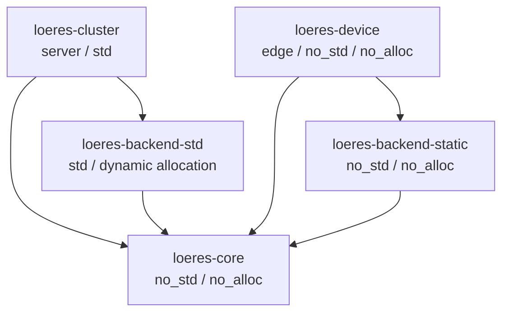
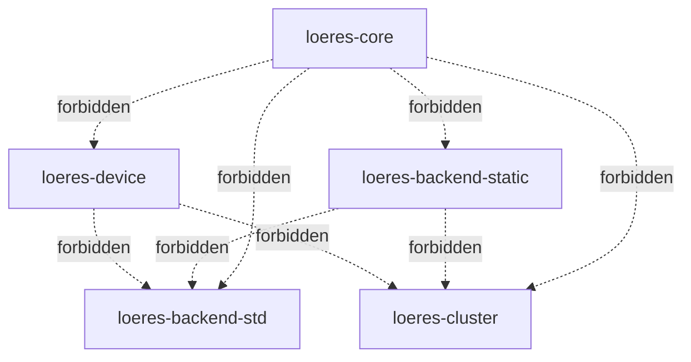
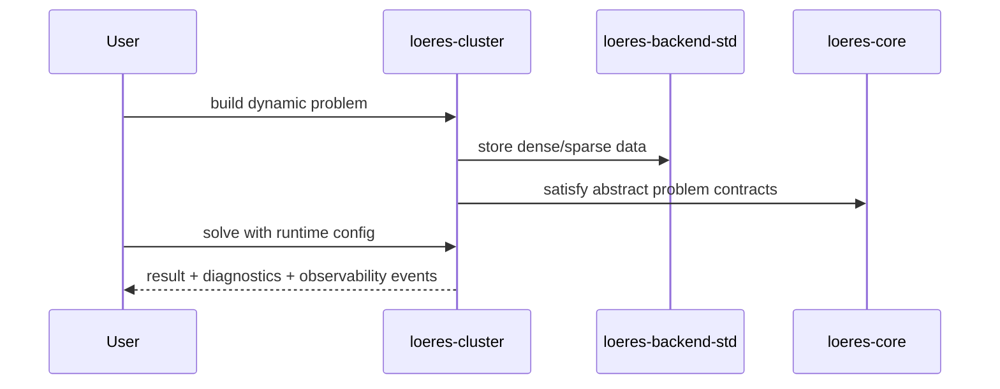
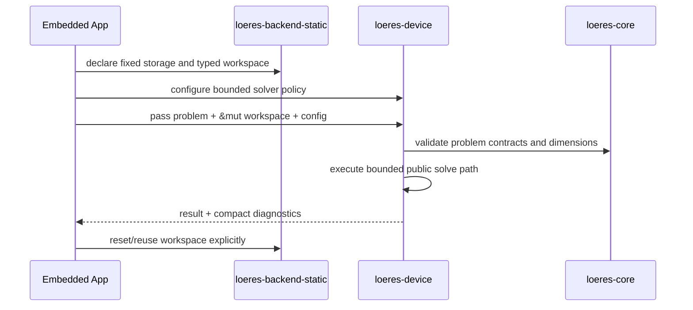
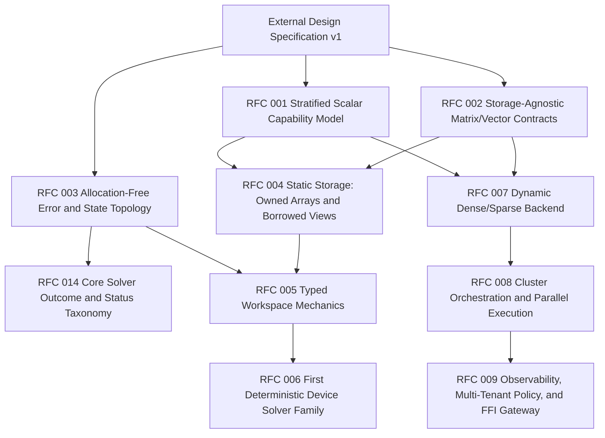

# Loeres External Design Specification v1

Status: Draft for architecture review  
Layer: External Design  
Source baseline: `loeres-requirements-v0.2.md`, `loeres-external-design-v0.1.md`, and v0.1 review notes  
Audience: Rust library users, crate maintainers, RFC authors, integration engineers

---

## 0. Purpose and Scope

This document defines the external design of the Loeres optimization library family. It is the bridge between the requirements specification and the upcoming RFC sequence.

The purpose of this document is to define what downstream developers can see, depend on, import, configure, and reason about. It intentionally does **not** define private numerical kernels, solver loops, factorization algorithms, sparse traversal internals, SIMD layouts, or concrete implementation macros.

Loeres is not a single solver crate. It is a Cargo workspace composed of separated crates that share mathematical contracts while refusing to merge server-side and edge-side execution assumptions.

The central design rule is:

> Loeres shares mathematical contracts, not storage, allocation, execution runtime, or operating-system assumptions.

This document therefore fixes public boundaries and crate topography before implementation-level RFCs begin.

This v1 document incorporates the reasonable public-boundary consequences from two architecture reviews of the earlier external design. It absorbs semver-safe error extensibility, workspace poisoning semantics, runtime configuration placement, cluster batch partial-failure semantics, validation-state policy, and static-view feature clarification. It intentionally does not freeze private solver algorithms or exact trait method bodies.

### 0.1 Normative Language

The words **must**, **must not**, **should**, **should not**, and **may** are used in their ordinary engineering-policy sense.

- **Must** means required for the external design to be accepted.
- **Should** means strongly preferred unless a later RFC records a justified exception.
- **May** means permitted but not required.

### 0.2 Design Level

This document is external design, not internal design.

It may define:

- crate boundaries;
- public module families;
- public type categories;
- public configuration concepts;
- public feature gates;
- dependency direction;
- developer workflows;
- validation and failure semantics.

It must not define:

- concrete solver loop bodies;
- numerical factorization algorithms;
- private storage layout optimizations;
- full trait method signatures where RFCs still need room to decide;
- private macros or code-generation schemes;
- exact benchmark thresholds.

Where this document shows Rust-like names, they define public design intent. Exact method signatures remain subject to Milestone RFC review.

### 0.3 Review Disposition Incorporated into v1

The v0.1 reviews were treated as design feedback, not implementation orders. The following points are accepted into this external design because they affect the public boundary:

| Review point | Disposition in v1 | Reason |
|---|---|---|
| Public error and diagnostic enums should remain semver-extensible | Accepted | Public enum growth can otherwise break downstream exhaustive matches |
| Error and diagnostic payloads must be size-budgeted | Accepted as an external constraint; exact byte caps deferred to RFC 003 | This affects device ABI and stack pressure, but exact numbers require RFC-level measurement |
| `loeres_core::linalg` may imply heavy kernels | Accepted by renaming the core module category to `loeres_core::access` | Core exposes storage access contracts, not BLAS-like operations |
| Public validation should avoid repeated O(N) rescans where input is already validated or trusted | Accepted with explicit validation-state policy | This is needed for large cluster workloads and for device loops with prevalidated static state |
| Device workspace failure may leave scratch memory unusable | Accepted through workspace poisoning semantics | Reuse after a failed solve must be explicit and safe |
| Device execution configuration should not be const-generic by default | Accepted | Const generics are reserved for dimensions and memory layout to avoid monomorphization bloat |
| Cluster batch solve must support per-item failure | Accepted | One bad model must not collapse an entire multi-tenant batch by default |
| `static-views` feature overlaps with baseline borrowed-view wording | Accepted and clarified | Baseline contiguous views and advanced strided/submatrix views are separate concepts |

The following points are deliberately not over-specified here:

- exact error byte-size caps;
- exact diagnostic field layout;
- exact `ValidatedInput` / `TrustedInput` wrapper signatures;
- exact workspace type-state implementation;
- exact unsafe policy, if any, for bypassing validation.

Those belong to the RFC sequence.

---

## 1. Workspace & Integration Topography

### 1.1 Workspace Layout

The Loeres repository must expose the following workspace structure:

```text
loeres/
├── Cargo.toml
├── LICENSE
├── NOTICE
├── README.md
├── CHANGELOG.md
├── ROADMAP.md
├── docs/
│   ├── src/
│   │   ├── introduction.md
│   │   ├── architecture.md
│   │   ├── cluster-user-guide.md
│   │   ├── device-user-guide.md
│   │   ├── threat-model.md
│   │   └── verification.md
│   └── book.toml
├── rfcs/
│   ├── proposed/
│   ├── done/
│   └── archive/
├── crates/
│   ├── loeres-core/
│   ├── loeres-backend-std/
│   ├── loeres-backend-static/
│   ├── loeres-cluster/
│   └── loeres-device/
├── examples/
│   ├── cluster-dynamic-qp/
│   ├── cluster-batch-solve/
│   ├── device-fixed-qp/
│   └── device-static-workspace/
├── xtask/
│   └── src/
└── .github/
    ├── workflows/
    │   ├── ci.yml
    │   ├── no-std.yml
    │   ├── msrv.yml
    │   └── release.yml
    ├── SECURITY.md
    ├── CONTRIBUTING.md
    └── ISSUE_TEMPLATE/
```

The `examples/` directory must be split by execution environment. A device example must not depend on `loeres-cluster`, `loeres-backend-std`, `tokio`, `rayon`, `tracing`, `std`, or `alloc`.

The `xtask/` crate may use `std` because it is a repository automation tool. It must never become a dependency of any library crate.

### 1.2 Required Crates

| Crate | Layer | Environment | Public responsibility | Forbidden from public surface |
|---|---:|---|---|---|
| `loeres-core` | 1 | `#![no_std]`, no `alloc` | Mathematical contracts, scalar capability families, vector/matrix access contracts, problem contracts, solver state categories, allocation-free errors | `Vec`, `Box`, `String`, `HashMap`, async runtime types, logging framework types, backend storage types, FFI handles |
| `loeres-backend-std` | 2 | `std` | Dynamic dense/sparse storage adapters, heap-backed model storage, server math adapter modules | Must not be depended on by `loeres-device` or `loeres-backend-static` |
| `loeres-backend-static` | 2 | `#![no_std]`, no `alloc` | Fixed-size owned storage, borrowed static views, dimension-bearing wrappers, typed workspace storage blocks | `std`, `alloc`, logging frameworks, async runtime types, server adapters, FFI handles |
| `loeres-cluster` | 3 | `std` | Server-side solving interface, dynamic model construction, batch execution, cancellation, parallelism, observability, optional native gateways | Must not be depended on by edge-facing crates |
| `loeres-device` | 3 | `#![no_std]`, no `alloc` | Deterministic edge-side solver entrypoints, bounded execution configuration, caller-owned typed workspace lifecycle | `std`, `alloc`, `dyn`-required baseline APIs, background threads, async runtimes, logging frameworks, FFI gateways |

### 1.3 Dependency Direction

The dependency graph must remain acyclic and environment-separated:



Forbidden edges:



The public API must make the forbidden edges unnecessary. For example, a device-facing error type must not need a server-only diagnostic type, and a core problem trait must not mention a concrete static or dynamic matrix type.

### 1.4 Public Import Model

The intended downstream import model is:

#### Cluster user

```toml
[dependencies]
loeres-cluster = { version = "0.x", features = ["batch", "parallel-rayon"] }
loeres-backend-std = { version = "0.x", features = ["dense"] }
```

Cluster users normally import:

- dynamic problem builders from `loeres-cluster`;
- dynamic vector/matrix adapters from `loeres-backend-std`;
- shared error and status categories from `loeres-core`.

#### Device user

```toml
[dependencies]
loeres-device = { version = "0.x", default-features = false }
loeres-backend-static = { version = "0.x", default-features = false, features = ["owned-arrays"] }
```

Device users normally import:

- fixed-size storage types or views from `loeres-backend-static`;
- deterministic solver entrypoints from `loeres-device`;
- shared error and status categories from `loeres-core`.

Device users must not need to import `loeres-cluster` or `loeres-backend-std` to solve a fixed-size problem.

### 1.5 Public Module Topography

The following module families define the public topography. Exact submodule names may change only through RFC review.

#### `loeres-core`

```text
loeres_core::scalar      // stratified scalar capability traits
loeres_core::access      // storage-agnostic vector/matrix access contracts; no heavy kernels
loeres_core::problem     // LP/QP/SOCP/model interface categories
loeres_core::solver      // solver status, step status, convergence categories
loeres_core::error       // allocation-free error topology
loeres_core::diagnostic  // compact diagnostic code/value categories, no logging output
loeres_core::dimension   // dimension descriptors and dimension mismatch categories
```

`loeres-core` must be usable by both cluster and device users without feature-selected environment changes. The `access` module name is intentional: it defines shape, indexing, borrowing, and fallible access contracts. It must not be interpreted as a required linear-algebra kernel module.

#### `loeres-backend-std`

```text
loeres_backend_std::dense       // heap-backed dense vectors/matrices
loeres_backend_std::sparse      // heap-backed sparse storage adapters
loeres_backend_std::view        // borrowed views over dynamic storage
loeres_backend_std::batch       // server-side batched storage containers
loeres_backend_std::adapter     // optional third-party numerical crate adapters
```

Adapter modules must be feature-gated.

#### `loeres-backend-static`

```text
loeres_backend_static::array      // owned fixed-size vector/matrix wrappers
loeres_backend_static::view       // borrowed fixed-size views over caller storage
loeres_backend_static::workspace  // typed workspace storage blocks
loeres_backend_static::dimension  // static dimension markers and descriptors
```

The static backend may provide both owned fixed arrays and borrowed views. Borrowed views are important for embedded integration because many users already own memory in peripheral buffers, DMA-safe regions, or statically allocated control-loop state.

#### `loeres-cluster`

```text
loeres_cluster::model       // dynamic model construction UX
loeres_cluster::solve       // sync solve entrypoints
loeres_cluster::batch       // batch and service-oriented APIs
loeres_cluster::runtime     // execution config, cancellation, timeout, parallelism
loeres_cluster::observe     // tracing/metrics/logging integration points
loeres_cluster::gateway     // optional FFI/native solver gateways
```

`loeres-cluster` is allowed to be ergonomic, dynamic, and integration-rich.

#### `loeres-device`

```text
loeres_device::problem      // fixed-size problem wrappers and supported problem families
loeres_device::solve        // deterministic solve entrypoints
loeres_device::config       // iteration caps, tolerances, timing modes, safety policy
loeres_device::workspace    // solver-specific typed workspace aliases and lifecycle
loeres_device::diagnostic   // compact no_std diagnostics, no logging framework
```

`loeres-device` must remain intentionally small.

### 1.6 Feature Flag Matrix

Feature flags must not collapse the server/edge boundary. In particular, no feature of `loeres-device`, `loeres-backend-static`, or `loeres-core` may enable `std`, `alloc`, async runtime types, logging framework types, or server numerical backends.

#### 1.6.1 `loeres-core`

| Feature | Default | Public meaning | Constraints |
|---|---:|---|---|
| _none_ | yes | Baseline `no_std` / no-`alloc` contract surface | Must compile on all supported device targets |
| `libm` | no | Enables optional no-`std` implementations for advanced scalar capability adapters where needed | Must not enable `std` or `alloc` |
| `fixed-point-hooks` | no | Exposes integration hooks for fixed-point scalar implementations | Must not select a concrete fixed-point crate by default |

No `loeres-core` feature may change core error layout in a way that breaks device ABI expectations inside the same semver line.

#### 1.6.2 `loeres-backend-static`

| Feature | Default | Public meaning | Constraints |
|---|---:|---|---|
| _none_ | yes | Minimal contiguous storage adapters and baseline trait implementations; may include simple borrowed slice adapters needed to satisfy core access contracts | No `std`, no `alloc`; no advanced slicing API |
| `owned-arrays` | no | Enables owned fixed-size wrappers around arrays | No heap allocation |
| `static-views` | no | Enables advanced borrowed view types such as row views, column views, sub-matrix views, and strided views | No heap allocation; must not require runtime reflection |
| `diagnostic-snapshot` | no | Enables compact numeric diagnostic snapshot structs | No strings, no logging framework |

`owned-arrays` and `static-views` may be enabled together. Baseline borrowed adapters are limited to contiguous, simple access. Advanced view construction belongs behind `static-views`. The RFC for the static backend must define whether any advanced view should become default after v0.x experience.

#### 1.6.3 `loeres-device`

| Feature | Default | Public meaning | Constraints |
|---|---:|---|---|
| _none_ | yes | Minimal deterministic solve entrypoints | No `std`, no `alloc` |
| `constant-iteration` | no | Exposes timing-stabilized solve modes that run a configured iteration count even after convergence has been detected | Must not claim cryptographic constant time |
| `diagnostic-snapshot` | no | Exposes compact numeric diagnostic output through result/state types | No strings, no logging framework |
| `panic-gate` | no | Enables release-gate instrumentation or attributes used by CI to detect panicking paths | Must be treated as tooling gate, not formal proof |

`constant-iteration` changes timing behavior and may change energy/runtime cost. It must be opt-in.

#### 1.6.4 `loeres-backend-std`

| Feature | Default | Public meaning | Constraints |
|---|---:|---|---|
| `dense` | yes | Heap-backed dense storage adapters | Server-only |
| `sparse` | no | Heap-backed sparse storage adapters | Server-only |
| `serde` | no | Serialization support for dynamic models and storage metadata | Server-only |
| `parallel-rayon` | no | Parallel storage kernels where appropriate | Server-only |
| `adapter-ndarray` | no | Adapter module for `ndarray`-style storage | Server-only, optional dependency |
| `adapter-nalgebra` | no | Adapter module for `nalgebra`-style storage | Server-only, optional dependency |
| `native-linalg` | no | Adapter point for BLAS/LAPACK-like native libraries | Server-only; must not be pulled by default |

Adapter features may coexist unless a later RFC records an incompatibility.

#### 1.6.5 `loeres-cluster`

| Feature | Default | Public meaning | Constraints |
|---|---:|---|---|
| `sync` | yes | Synchronous server solve APIs | Server-only |
| `batch` | yes | Batch solve orchestration APIs | Server-only |
| `parallel-rayon` | no | Parallel execution controls and thread-pool integration | Server-only |
| `async-tokio` | no | Async orchestration handles and cancellation integration | Server-only |
| `observability-tracing` | no | `tracing` span integration | Server-only |
| `observability-metrics` | no | Metrics sink integration | Server-only |
| `serde` | no | Model/config serialization | Server-only |
| `ffi-gateway` | no | Explicit opt-in gateway to native or legacy solvers | Server-only; audited boundary required |

`ffi-gateway` must never be a default feature.

### 1.7 Mutually Exclusive Configurations

The following configurations are invalid by design:

| Invalid configuration | Reason |
|---|---|
| `loeres-device` depending on `loeres-cluster` | Collapses compile-time environment isolation |
| `loeres-device` depending on `loeres-backend-std` | Pulls server storage assumptions into edge path |
| `loeres-backend-static` depending on `loeres-backend-std` | Violates no-`std` / no-`alloc` static backend rule |
| `loeres-core` depending on any backend crate | Core must define contracts, not storage |
| Any device-facing feature enabling `std` or `alloc` | Violates edge baseline |
| Device baseline requiring `dyn Trait` | Violates monomorphized zero-cost design goal |
| `ffi-gateway` on edge crates | Violates edge safety and audit boundary |

These invalid configurations must be enforced by workspace dependency rules, CI, and compile-fail tests where practical.

### 1.8 Target Triple Profiles

Loeres must define explicit target profiles. These profiles are not marketing claims of complete platform support; they are design-test anchors.

#### Cluster baseline targets

| Profile | Target triple | Purpose |
|---|---|---|
| Linux server baseline | `x86_64-unknown-linux-gnu` | Primary CI and release target for cluster crates |
| Linux portable server | `x86_64-unknown-linux-musl` | Optional static-linking oriented target |
| ARM Linux server | `aarch64-unknown-linux-gnu` | Cloud ARM and edge gateway servers |
| Windows server/dev | `x86_64-pc-windows-msvc` | Development and service integration target |
| macOS dev | `aarch64-apple-darwin` | Development and CI smoke target |

Cluster crates may use `std`, dynamic allocation, threads, async runtimes, and observability integrations.

#### Device reference targets

| Profile | Target triple | Purpose | Notes |
|---|---|---|---|
| Reference hardware-float MCU | `thumbv7em-none-eabihf` | Primary `no_std` / no-`alloc` edge design-test target | Reference profile for early floating-point behavior documentation |
| Software-float MCU | `thumbv7em-none-eabi` | Verifies that device code does not assume hardware FPU by accident | Performance may be unsuitable for some solvers |
| RISC-V embedded candidate | `riscv32imac-unknown-none-elf` | Portability candidate for `loeres-core` and static backend | Solver support may be staged |
| WASM bare target candidate | `wasm32-unknown-unknown` | Optional no-`std` portability smoke target | Not a real-time target by itself |

Device documentation must distinguish:

- compile support;
- reference-target behavior;
- timing characterization;
- bit-for-bit reproducibility claims.

No v0.x device API may claim bit-for-bit reproducibility across all target triples unless a later verification document proves that claim.

### 1.9 Verification Targets and Repository Automation

The repository must include `xtask` commands or equivalent CI jobs for:

| Check | Required scope |
|---|---|
| `no_std` compile check | `loeres-core`, `loeres-backend-static`, `loeres-device` |
| no-`alloc` dependency check | `loeres-core`, `loeres-backend-static`, `loeres-device` |
| dependency graph check | All crates |
| forbidden feature check | Edge-facing crates |
| panic-averse release gate | Device public solve entrypoints |
| target profile check | Baseline cluster and device target profiles |
| docs examples check | Cluster examples and device examples separately |

The exact tooling is an RFC subject. The external contract is that these checks exist and are visible to maintainers.

---

## 2. Core Trait Architecture: The Abstract Interface

### 2.1 Core Design Objective

`loeres-core` is the abstract backbone of the ecosystem. It defines the public mathematical vocabulary shared by all crates.

It must not know whether a vector is:

- a stack-owned array;
- a borrowed embedded control-loop buffer;
- an `ndarray`-style heap array;
- a sparse server matrix;
- a third-party adapter.

It must only know the contracts that such storage must satisfy.

### 2.2 Stratified Scalar Concept

`loeres-core` must use stratified scalar capabilities rather than a monolithic `Scalar` trait.

The external scalar families are:

| Scalar family | Purpose | Examples of capability category | Baseline? |
|---|---|---|---:|
| `BaseScalar` | Minimal arithmetic representation | copyable value, equality/order category, zero/one category, addition/subtraction/multiplication/negation category | yes |
| `FiniteScalar` | Boundary validation for hostile or broken inputs | finite/NaN/infinite checks or equivalent domain-validity checks | required by public solve boundaries that accept floating-like values |
| `DivisibleScalar` | Algorithms that need guarded division or inverse-like operations | checked division, denominator validation, reciprocal category | opt-in |
| `MetricScalar` | Tolerances, residuals, convergence metrics | absolute magnitude, epsilon/tolerance comparison, norm component category | opt-in by convergence-checking solvers |
| `AdvancedNumericalScalar` | Expensive or specialized numerical functions | square root, logarithm, exponential, powers, barrier-method support | strictly opt-in |
| `FixedPointScalar` | Fixed-point integration category | scale metadata, saturation/checked conversion category | optional extension |

The base scalar family must not require division, square root, logarithms, exponentials, powers, heap allocation, or string formatting.

This stratification is a public design commitment. Exact trait method names and blanket implementations are Milestone 1 RFC topics.

### 2.3 Scalar Opt-In Rules

A solver family must state the minimum scalar capability family it requires.

Examples:

| Solver or operation category | Minimum scalar capability category |
|---|---|
| Basic affine residual evaluation | `BaseScalar` |
| Public floating-point input validation | `BaseScalar + FiniteScalar` |
| Residual tolerance comparison | `BaseScalar + MetricScalar` |
| Algorithms requiring division | `BaseScalar + DivisibleScalar` |
| Interior-point-style barrier families | `BaseScalar + DivisibleScalar + MetricScalar + AdvancedNumericalScalar` |

`loeres-core` must not force every backend to implement `AdvancedNumericalScalar` just because one future algorithm may need it.

### 2.4 Storage-Agnostic Vector and Matrix Bindings

`loeres-core::access` must define public contracts for vectors and matrices without exposing storage or implying heavy linear-algebra kernels.

The public vector design must cover:

- dimension query;
- immutable element access;
- mutable element access or fallible write access where applicable;
- borrowed view compatibility;
- dimension mismatch reporting;
- no hidden allocation;
- no required virtual dispatch.

The public matrix design must cover:

- row count and column count query;
- immutable element access;
- mutable element access or fallible write access where applicable;
- storage-layout neutrality;
- dense and sparse backend compatibility;
- static and dynamic dimension compatibility;
- no commitment to row-major or column-major as a core-level rule.

Core must not define a required method that assumes one storage layout is always efficient. Specialized kernels such as row dot products, sparse traversal, triangular solves, preconditioner application, or factorization entrypoints must be optional extension traits or backend-owned kernel traits.

### 2.5 Static Dispatch Rule

The baseline core and device-facing abstractions must be compatible with monomorphization through generics and associated types.

Device-facing APIs must not require:

- `dyn Trait`;
- plugin registries;
- trait-object solver lists;
- boxed closures;
- allocator-backed callback chains.

Server-only crates may provide dynamic dispatch as an ergonomic convenience, but this must be isolated to `loeres-cluster` and must not leak into `loeres-core` contracts required by device code.

### 2.6 Dimension Model

`loeres-core::dimension` must provide public dimension categories that can represent both dynamic and static contexts.

The external design requires at least these categories:

| Category | Purpose |
|---|---|
| `VariableCount` | Number of decision variables |
| `ConstraintCount` | Number of constraints |
| `RowCount` / `ColumnCount` | Matrix shape reporting |
| `StaticDimension` marker category | Compile-time dimension-bearing types in static backend |
| `DynamicDimension` value category | Runtime dimensions in std backend |
| `DimensionMismatch` error context | Compact mismatch reporting without strings |

Dimension metadata must be representable without allocation.

### 2.7 Problem Families

`loeres-core::problem` must define public problem-family contracts, but not concrete modeling DSLs.

Initial public problem families:

| Family | Core public role | Cluster role | Device role |
|---|---|---|---|
| LP | Linear objective and linear constraints category | Dynamic models may support broad LP construction | Device support optional and bounded |
| QP | Quadratic objective with linear constraints category | Server may support dynamic dense/sparse QP | Primary candidate for fixed-size device solver |
| SOCP | Second-order cone category | Server may support dynamic conic models | Device support limited and staged |
| First-order structured problem | Objective/residual/gradient-like category | Useful for large approximate server solvers | Useful for capped deterministic kernels |

Mixed-integer programming, nonlinear symbolic modeling, and expression parsing are outside the device baseline.

### 2.8 Error Topology

`loeres-core::error` must expose allocation-free error enums.

The public error topology must cover:

| Error category | Meaning |
|---|---|
| `DimensionMismatch` | Input and storage shapes are incompatible |
| `InvalidInput` | Input violates declared domain or problem contract |
| `NonFiniteInput` | NaN, infinity, or equivalent invalid finite check failure |
| `SingularMatrix` | Matrix is singular under the selected solver family |
| `IllConditioned` | Problem exceeds declared conditioning or stability threshold |
| `WorkspaceTooSmall` | Provided workspace cannot hold required solver state |
| `UnsupportedProblemStructure` | Problem shape is valid but unsupported by selected solver |
| `NumericalDomain` | Operation would leave a solver's valid numerical domain |
| `InternalInvariantViolation` | A non-user-facing invariant was violated; must be rare and auditable |

Non-convergence at a bounded iteration cap is **not** a `SolverError`. It is a solver status, represented under RFC 014 by `SolveStatus::NotConverged` with `TerminationReason::IterationCap`. `PanicGateViolation` is likewise not a runtime error category; panic-gate findings are CI/release-gate results owned by the verification tooling (RFC 010).

Error values must not require heap allocation, string ownership, backtraces, or formatting support.

Public error enums in `loeres-core` should be semver-extensible. The external design therefore requires public error enums to be designed as non-exhaustive categories unless a later RFC proves that a closed enum is required for device ABI reasons. Downstream users must not be encouraged to rely on exhaustive matching over all future error categories.

Error values on device-facing result paths must be size-budgeted. The exact byte-size limit is an RFC 003 decision, but the public design must avoid embedding large diagnostic snapshots directly into common `Result<T, E>` error variants. Large or optional diagnostic detail must live behind explicit diagnostic snapshot types or feature-gated result metadata.

### 2.9 Diagnostic Topology Without Logging

`loeres-core::diagnostic` may expose compact diagnostic categories that are data-only.

Examples of allowed diagnostic information:

- iteration count;
- last residual magnitude category;
- last objective value category;
- conditioning estimate category;
- active failure phase code;
- dimension pair that failed validation;
- workspace layout identifier.

Examples of forbidden core/device diagnostic mechanisms:

- `String` messages;
- `Vec` of events;
- logging framework handles;
- tracing spans;
- heap-allocated report objects.

This resolves the device diagnostic dilemma by allowing structured numeric diagnostics while avoiding logging frameworks in edge crates.

Public diagnostic enums and compact snapshot categories should also be semver-extensible unless a later RFC records a closed representation for ABI stability. Diagnostic payloads must be size-budgeted separately from error payloads. A public solve entrypoint should not force every result to carry a large diagnostic structure when diagnostics are disabled or when only a compact status code is needed.

### 2.10 Solver State and Step Outcome Categories

`loeres-core::solver` must define public status categories shared by server and device crates.

Required outcome categories:

Under RFC 014 these are split into step-level outcomes, terminal status, and terminal reason; boundary rejection and fail-safe failure are `SolverError`, not status categories:

| Category | Kind | Meaning |
|---|---|---|
| `StepOutcome::Continue` | step | Solver may continue under its configured cap |
| `StepOutcome::Converged` | step | Convergence criterion met at this step |
| `StepOutcome::NoProgress` | step | Step made no usable progress |
| `SolveStatus::Converged` | terminal status | Convergence criterion met within the cap |
| `SolveStatus::NotConverged` | terminal status | Bounded run ended without convergence (not an error) |
| `TerminationReason::{ConvergenceCriterion, IterationCap, NoProgress}` | terminal reason | Why the bounded loop stopped |

Boundary-validation rejection and fail-safe failure are reported as `SolverError` (RFC 014 §5.1), not as terminal status categories.

The exact form may be enum-based or struct-based by RFC. It must remain allocation-free in core.

---

## 3. Cluster Developer Interface

### 3.1 Cluster Design Objective

`loeres-cluster` is the server-side developer interface. It may optimize for ergonomics, dynamic problem sizes, high throughput, integration with service runtimes, and observability.

Unlike device crates, cluster crates may use:

- `std`;
- heap allocation;
- dynamic models;
- async runtimes through feature gates;
- parallel execution libraries through feature gates;
- logging and tracing through feature gates;
- optional FFI gateways through audited feature gates.

Cluster convenience must not create dependencies from edge-facing crates back into cluster crates.

### 3.2 Dynamic Problem Construction

Cluster users need runtime model construction. The public interface should provide builder-style or model-object APIs for:

- dynamic variable counts;
- dynamic constraint counts;
- dense matrix inputs;
- sparse matrix inputs;
- objective vectors and matrices;
- bounds;
- constraint metadata;
- batch model groups.

The model construction API may own heap-backed storage. It may also borrow user storage when useful.

The external design requires public model categories such as:

```text
loeres_cluster::model::DynamicLp
loeres_cluster::model::DynamicQp
loeres_cluster::model::DynamicSocp
loeres_cluster::model::ModelBuilder
loeres_cluster::model::BatchModelSet
```

Exact names are RFC subjects. The categories are required.

### 3.3 Cluster Storage Binding

`loeres-cluster` should use `loeres-backend-std` as its default storage source.

The public storage flow is:



Cluster APIs may expose borrowed and owned variants.

### 3.4 Orchestration and Runtime Control

`loeres-cluster::runtime` must define public configuration categories for:

| Configuration category | Public meaning |
|---|---|
| `ExecutionBudget` | Time budget, iteration budget, or work budget for a solve request |
| `Cancellation` | User-initiated or service-initiated cancellation handle |
| `Parallelism` | Thread count or parallelism policy when enabled |
| `BatchPolicy` | Controls batching, queue limits, fairness, and backpressure |
| `NumericalPolicy` | Tolerances, conditioning thresholds, scaling policy |
| `FailurePolicy` | How non-convergence, invalid input, backend failure, and batch partial failure are reported |
| `ValidationPolicy` | Full validation, cached validation, trusted-input assertion, and validation reuse settings |

Cluster cancellation may be async-aware when `async-tokio` is enabled. The core and device layers must not depend on this cancellation type.

### 3.5 Solve Entrypoints

`loeres-cluster::solve` should expose at least three public solve families:

| Entrypoint family | Purpose |
|---|---|
| Synchronous solve | Direct server or CLI use without async runtime |
| Batch solve | High-throughput processing of multiple dynamic models |
| Async solve | Optional runtime-integrated solve when feature-enabled |

The public result must include:

- solve status;
- objective/solution category where available;
- structured error on failure;
- diagnostics where enabled;
- timing and iteration metadata where enabled.

Batch solve APIs must use per-item outcome semantics by default. A batch containing many models should return an ordered collection of individual outcomes, so that one invalid, ill-conditioned, cancelled, or unsupported model does not force unrelated items to fail. A separate batch-level error may be returned only for failures that prevent the batch from being scheduled or represented at all, such as invalid global configuration, exhausted service budget before dispatch, or catastrophic backend failure.

### 3.6 Observability Hooks

`loeres-cluster::observe` must define opt-in public integration points for:

- tracing spans;
- metrics counters and histograms;
- structured logs;
- solve lifecycle events;
- backend gateway events;
- input rejection events;
- timeout and cancellation events.

Observability must be server-only. `loeres-core`, `loeres-backend-static`, and `loeres-device` must not expose public types from `tracing`, `log`, `metrics`, or similar frameworks.

### 3.7 FFI Gateway Boundary

`loeres-cluster::gateway` may provide optional adapters to native or legacy solvers.

Rules:

- FFI must be feature-gated behind `ffi-gateway`.
- FFI must not be default.
- FFI must not be reachable from `loeres-core`, `loeres-backend-static`, or `loeres-device`.
- FFI gateway types must not appear in core problem contracts.
- FFI results must be normalized into Loeres structured result/error categories at the cluster boundary.
- FFI safety requirements must be covered by a later RFC before implementation.

### 3.8 Cluster Developer UX Example

The intended cluster UX is:

1. Choose dynamic storage features.
2. Build or import a dynamic problem.
3. Configure execution budget and parallelism.
4. Optionally attach observability.
5. Solve.
6. Receive structured result and diagnostics.

Illustrative flow:

```text
User dynamic data
    -> loeres-backend-std dense/sparse storage
    -> loeres-cluster model builder
    -> runtime config: timeout / cancellation / parallelism
    -> solve
    -> result: solution / status / diagnostics / observability
```

This flow is intentionally unlike the device flow. Cluster ergonomics may trade determinism for throughput and integration.

---

## 4. Device Developer Interface

### 4.1 Device Design Objective

`loeres-device` is the edge-side developer interface. It must optimize for deterministic resource use, no heap allocation, small binaries, bounded iteration behavior, and analyzable public solve paths.

Device APIs must be explicit rather than convenient.

Device crates must not use:

- `std`;
- `alloc`;
- background threads;
- async runtime types;
- logging framework types;
- server storage adapters;
- native FFI gateways;
- baseline virtual dispatch.

### 4.2 Static Type Layout

Device users must be able to declare dimensions and storage at compile time or initialization time.

The public type categories in `loeres-backend-static` must include:

| Category | Purpose |
|---|---|
| Owned fixed vector | Stack/static storage for a vector with known length |
| Owned fixed matrix | Stack/static storage for a matrix with known dimensions |
| Borrowed fixed vector view | View over caller-owned memory with dimension metadata |
| Borrowed fixed matrix view | View over caller-owned memory with row/column/stride metadata |
| Static dimension marker | Type-level or const-level dimension category |
| Typed workspace block | Solver-specific caller-owned scratch state |

The exact representation may use arrays, references, const generics, or dimension marker types. It must not require nightly-only generic const expressions as a baseline requirement.

### 4.3 Owned Arrays and Borrowed Views

The static backend must not force every embedded user to copy data into Loeres-owned arrays.

It should support two integration styles:

#### Owned-array style

Suitable when the application wants Loeres-owned stack/static storage.

```text
FixedVector<N, S>
FixedMatrix<R, C, S>
```

#### Borrowed-view style

Suitable when the application already owns memory.

```text
VectorView<'a, N, S>
VectorViewMut<'a, N, S>
MatrixView<'a, R, C, S>
MatrixViewMut<'a, R, C, S>
```

These names are illustrative. The external requirement is that both owned and borrowed models are supported or explicitly phased by RFC.

Borrowed views must preserve the no-alloc rule.

### 4.4 Caller-Owned Typed Workspace Paradigm

Device solvers must not allocate hidden scratch memory.

The primary device lifecycle is:



The public workspace design must include:

| Workspace concept | Requirement |
|---|---|
| Solver-specific type | Workspace type must correspond to a solver family/problem family |
| Caller ownership | Caller constructs and owns the workspace |
| Unique mutable borrow | Solve entrypoint receives workspace by unique mutable reference |
| Explicit reset | Reuse must require explicit reset or documented initialization lifecycle |
| Poison state | Any failed solve may mark the workspace as needing reset before reuse |
| Size visibility | Workspace memory footprint must be visible through type, associated metadata, or documentation |
| No mid-flight allocation | Solver must not allocate additional hidden buffers |

Raw scratch-buffer APIs may exist only as secondary low-level APIs. They must fail immediately with `WorkspaceTooSmall` or equivalent if the buffer does not satisfy the required layout.

Workspace poisoning semantics are part of the public device contract. Unless a solver family explicitly documents a stronger guarantee, any solve returning `Err` must be assumed to have left the workspace in a reset-required state. The next solve call must not rely on partially mutated workspace contents. The public lifecycle must therefore expose one of the following design patterns by RFC:

- a reset method that transitions the workspace back to a ready state;
- a type-state style ready/poisoned workspace distinction;
- or a documented initialization lifecycle proving that every solve fully overwrites all mutable workspace regions before use.

The default external expectation is conservative: after error, reset before reuse.

### 4.5 Deterministic Entrypoints

`loeres-device::solve` must expose deterministic entrypoint categories.

Required public configuration categories:

| Configuration category | Meaning |
|---|---|
| `MaxIterations` | Hard cap for iterative work |
| `TolerancePolicy` | Residual/objective/constraint tolerance categories |
| `ConditionPolicy` | Ill-conditioning threshold categories |
| `TimingMode` | Early-exit vs constant-iteration behavior |
| `InputValidationPolicy` | Boundary validation settings |
| `DiagnosticPolicy` | Compact diagnostics on/off or detail level |

Device solve configuration values such as maximum iteration count, tolerance thresholds, condition thresholds, timing mode, and diagnostic level should be runtime configuration fields rather than type-level const generics. Const generics are reserved primarily for dimensions, memory layout, and workspace sizing. This avoids compiling separate solver machine code for every ordinary policy value while still preserving static memory bounds.

Device solve entrypoints must:

- validate public inputs before entering calculation loops;
- respect the configured maximum iteration cap;
- return structured errors rather than panic for expected failure modes;
- avoid hidden allocation;
- avoid required dynamic dispatch;
- avoid background execution;
- avoid server observability hooks.

### 4.6 Timing Modes

Device timing behavior must be explicit.

| Mode | Meaning | Constraint |
|---|---|---|
| Early-exit bounded mode | Solver may stop when convergence is detected before max iterations | Still bounded by maximum iteration cap |
| Constant-iteration mode | Solver records convergence internally but continues to execute the configured iteration count | Must not claim cryptographic constant-time |
| Validation-only rejection path | Invalid input exits before calculation loop | Must return structured rejection error |

Constant-iteration mode is useful for timing stabilization and side-channel reduction, but it is not a proof of constant-time execution.

### 4.7 Device Diagnostics Without Logging

`loeres-device::diagnostic` may expose compact diagnostics through result or state types.

Allowed examples:

- number of iterations executed;
- convergence status;
- last residual class;
- conditioning estimate class;
- validation phase failure code;
- dimension mismatch code;
- workspace layout code.

Forbidden examples:

- strings;
- heap-allocated diagnostic reports;
- logging macros as public API;
- tracing spans;
- background telemetry queues.

An optional no-`std` user-provided diagnostic sink may be considered by RFC, but it must be a trait-like data sink that does not require logging frameworks or allocation.

### 4.8 Floating-Point Reference Policy

Device documentation must define a reference target profile for floating-point behavior.

The initial external design reference is:

```text
Reference edge floating-point target:
thumbv7em-none-eabihf
```

Rules:

- A Cargo feature alone must not be described as guaranteeing bit-for-bit determinism across all embedded architectures.
- Target profiles must document FPU assumptions.
- Software-float targets must be treated separately from hardware-float targets.
- Any future bit-for-bit reproducibility claim must be tied to a target profile, compiler settings, scalar family, and solver family.

### 4.9 Device Developer UX Example

The intended device UX is:

1. Select a supported fixed-size problem family.
2. Choose static storage: owned arrays or borrowed views.
3. Construct a typed workspace.
4. Configure max iterations, tolerance policy, and timing mode.
5. Call a deterministic solve entrypoint with `&mut workspace`.
6. Receive structured result and compact diagnostics.
7. If the solve succeeds, reuse the workspace only according to its documented lifecycle. If the solve fails, reset the workspace before the next solve unless the selected solver explicitly guarantees automatic recovery.

Illustrative flow:

```text
Caller-owned fixed memory
    -> loeres-backend-static storage/view
    -> loeres-device typed workspace
    -> bounded config: max iterations / tolerance / timing mode
    -> solve with &mut workspace
    -> result: status / solution view / compact diagnostic code
```

This flow is intentionally less dynamic than the cluster flow.

---

## 5. External Threat Validation Rules

### 5.1 Boundary Validation Principle

Public solve entrypoints must validate all externally supplied problem data before entering private calculation loops.

This applies to both cluster and device crates, but the consequences differ:

- Cluster validation protects multi-tenant service availability, data confidentiality, runtime stability, and host resources.
- Device validation protects control-loop availability, bounded execution, memory integrity, and panic-averse behavior.

### 5.2 Public Input Sanitization Policies

Public solve functions must validate the following categories where applicable:

| Validation category | Cluster | Device |
|---|---:|---:|
| Dimension compatibility | required | required |
| Matrix/vector shape compatibility | required | required |
| Finite scalar check for floating-like scalars | required unless skipped through explicit validated/trusted-input policy | required unless scalar family makes it irrelevant, or unless a validated-state wrapper proves prior validation |
| Bounds validity | required where applicable | required where applicable |
| Constraint structure validity | required | required |
| Workspace availability | internal/dynamic or explicit | required before solve loop |
| Iteration cap presence | required for service safety | mandatory |
| Timeout/cancellation budget | recommended/feature-gated | not applicable as runtime mechanism |
| Conditioning threshold | recommended or solver-dependent | required where solver family needs it |
| Unsupported problem family detection | required | required |

Boundary validation may be expensive for large cluster models. The public design must therefore distinguish raw external input from input that has already crossed a validation boundary. The allowed public states are:

| Input state | Meaning | Public consequence |
|---|---|---|
| Raw input | User-provided or deserialized data not yet validated | Full boundary validation required |
| Validated input | Loeres has already validated shape/domain invariants under a recorded policy | Repeated solve calls may reuse validation state if relevant data is immutable or versioned |
| Trusted input | Caller explicitly asserts that data is valid under an application-level trust boundary | Cluster may skip some O(N) scans under explicit policy; device use requires stricter RFC approval |

The exact representation may be wrapper types, builder states, validation tokens, or policy objects. The key external rule is that validation bypass must be explicit, visible in the public API, and impossible to trigger accidentally through a default solve call.

### 5.3 Fail-Safe Semantics

When invalid or adversarial input is encountered, Loeres must fail closed.

Fail-safe behavior means:

- no panic for expected invalid input;
- no infinite loop;
- no hidden allocation attempt in device crates;
- no silent truncation of dimensions;
- no unchecked division by zero;
- no best-effort solve after validation has identified unsupported structure;
- no use of uninitialized workspace regions;
- no fallback from device path to cluster path.

The public result must identify the failure category through a structured error.

For device solvers, fail-safe semantics include workspace state. If a solve fails after mutating its workspace, the workspace must be considered reset-required unless the solver explicitly documents that the failure leaves it ready for immediate reuse. No public device API may silently continue using a poisoned workspace as if it were freshly initialized.

For cluster batch solvers, fail-safe semantics include failure isolation. A bad model inside a batch should produce an item-level failure outcome, not a whole-batch failure, unless the batch itself could not be represented, scheduled, or safely executed.

### 5.4 Cluster Threat Rules

Cluster APIs must treat user-submitted models as potentially hostile.

Public cluster rules:

| Threat | External design response |
|---|---|
| Memory exhaustion | batch limits, model size limits, allocation failure reporting, optional service policy |
| CPU exhaustion | execution budgets, cancellation, timeout, batch fairness |
| FFI compromise | opt-in FFI gateway, audited boundary, default-off native adapters |
| Cross-tenant leakage | no global mutable solver state exposed by default; observability redaction policies by RFC |
| Non-finite adversarial values | boundary validation and structured rejection |
| Ill-conditioned models | solver-specific conditioning policy and structured failure |
| Bad item inside batch | per-item failure outcome by default, not automatic whole-batch failure |
| Repeated expensive validation | explicit validated/trusted input state; never implicit skipping |

### 5.5 Device Threat Rules

Device APIs must treat externally supplied sensor/control data as potentially hostile or corrupted.

Public device rules:

| Threat | External design response |
|---|---|
| Infinite loop trigger | mandatory maximum iteration cap |
| Heap exhaustion | no heap allocation |
| Stack misuse through large copies | borrowed APIs and explicit `&mut` workspace lifecycle |
| Buffer overflow | fallible access contracts and bounded storage wrappers |
| Division-by-zero path | scalar capability stratification and guarded domain validation |
| Timing manipulation | bounded mode and optional constant-iteration mode |
| Non-finite values | finite validation where scalar family supports it |
| Unsupported structure | structured rejection before calculation loop |

### 5.6 Panic-Averse Release Gates

Device public solve entrypoints must be subject to panic-averse release gates.

The external contract is:

- `unwrap` and `expect` must not appear on public device solve paths except in reviewed unreachable proof contexts accepted by RFC.
- Indexing paths must use bounds-aware or statically bounded access patterns.
- Panic-detection tooling may be used in CI.
- Such tooling is a release gate, not a mathematical proof of panic freedom.
- Any known limitation of the gate must be documented.

### 5.7 Error and Diagnostic Disclosure

The public error topology must provide enough information for safe response without leaking internal solver invariants.

Cluster may expose richer diagnostics and observability, subject to privacy policy and feature gates.

Device must expose only compact data-oriented diagnostics.

---

## 6. External Design Decisions

### ED-001: Five-Crate Workspace Is the Public Boundary

Decision: Loeres uses five public crates: `loeres-core`, `loeres-backend-std`, `loeres-backend-static`, `loeres-cluster`, and `loeres-device`.

Rationale: This makes environment separation visible to downstream developers and enforceable by Cargo dependency direction.

### ED-002: Crate Selection, Not Runtime Mode Selection

Decision: Users choose server or edge behavior by depending on the appropriate crate.

Rationale: Runtime mode switches would hide environment assumptions and risk accidental dependency bleed.

### ED-003: Core Defines Capability Categories, Not Storage

Decision: `loeres-core` defines scalar, vector, matrix, problem, solver, dimension, error, and diagnostic contracts. It does not define concrete storage.

Rationale: Storage belongs to backends. Core must remain shared and no-alloc.

### ED-004: Scalar Capabilities Are Stratified

Decision: Scalar requirements are split into base, finite, divisible, metric, advanced numerical, and fixed-point categories.

Rationale: Edge solvers should not be forced to support expensive or unavailable numerical operations unless the selected solver requires them.

### ED-005: Device Workspace Is Typed and Caller-Owned

Decision: Device solvers use caller-owned typed workspaces as the primary public model.

Rationale: This exposes memory footprint, prevents hidden allocation, and makes solver memory reviewable before execution.

### ED-006: Device Diagnostics Are Data, Not Logs

Decision: Device diagnostics are compact numeric/status data carried by results or state, not logging framework output.

Rationale: Embedded users need debugging signals without pulling in `std`, allocation, formatting, or logging frameworks.

### ED-007: Floating-Point Reproducibility Is Target-Scoped

Decision: The design defines reference target profiles and forbids broad bit-for-bit reproducibility claims in v0.x.

Rationale: Floating-point behavior depends on ISA, compiler, scalar family, FPU availability, and solver design.

### ED-008: FFI Is Cluster-Only and Default-Off

Decision: Native solver gateways may exist only in `loeres-cluster` and server backends behind explicit feature gates.

Rationale: FFI is incompatible with the safety and audit profile of the edge baseline.

### ED-009: Core Access Module Avoids Heavy Linear-Algebra Semantics

Decision: The public core vector/matrix contract module is named and described as an access-contract layer, not a linear-algebra kernel layer.

Rationale: Core must expose shape, indexing, borrowing, and fallible access. Heavy operations such as factorization, BLAS-like multiplication, sparse traversal kernels, and preconditioners belong to backend or solver RFCs.

### ED-010: Public Error and Diagnostic Categories Are Semver-Extensible

Decision: Public error and diagnostic enums should be non-exhaustive unless an RFC records a closed ABI reason.

Rationale: The solver family will grow. New public error categories should not force downstream users to rewrite exhaustive matches in ordinary semver-compatible releases.

### ED-011: Device Workspace Failure Is Reset-Required by Default

Decision: A failed device solve may poison the caller-owned workspace. The default public rule is reset-before-reuse after failure.

Rationale: Solver internals may partially mutate scratch regions before detecting singularity, ill-conditioning, or numerical-domain violations. Reuse must be explicit and safe.

### ED-012: Device Policy Values Are Runtime Configuration, Not Type-Level Solver Identity

Decision: Device execution policy values such as iteration caps and tolerance thresholds should be runtime configuration fields. Const generics are reserved for dimensions and memory layout.

Rationale: Encoding ordinary policy values at type level risks monomorphization bloat and excessive flash usage on microcontrollers.

### ED-013: Cluster Batch Failure Is Per-Item by Default

Decision: Batch solve APIs return individual outcomes for individual models by default.

Rationale: Multi-tenant and high-throughput workloads must isolate failures. One malformed or ill-conditioned model should not invalidate unrelated batch items.

---

## 7. RFC Roadmap Derived from This External Design

The following RFC sequence should follow this external design. RFC references use the canonical flat numbering (RFC 000); the authoritative full sequencing, including the cross-cutting RFCs 010–013 and RFC 014, is maintained in the roadmap document.



### 7.1 Milestone 1: Core and Mathematical Interfaces

| RFC | Scope |
|---|---|
| RFC 001 | Stratified scalar capability model; exact method names; primitive scalar implementations; optional advanced capabilities |
| RFC 002 | Vector/matrix access contracts; dimensions; fallible access; static dispatch; layout-neutral extension traits; `access` module naming and non-kernel guarantees |
| RFC 003 | Allocation-free errors, statuses, state summaries, compact diagnostics, non-exhaustive enum policy, and byte-size budget tests |
| RFC 014 | Core solver outcome/status taxonomy (SolveStatus / StepOutcome / TerminationReason); device and cluster report derivation |

### 7.2 Milestone 2: Static Backend and Device Interface

| RFC | Scope |
|---|---|
| RFC 004 | Const-generic owned storage, borrowed views, dimension markers, stable Rust limitations |
| RFC 005 | Typed workspace lifecycle, sizing visibility, reset/poison semantics, low-level raw scratch fallback rules |
| RFC 006 | First device solver family, deterministic entrypoint categories, runtime policy configuration, timing modes, panic-averse gate plan |

### 7.3 Milestone 3: Dynamic Backend and Cluster Interface

| RFC | Scope |
|---|---|
| RFC 007 | Dynamic dense/sparse storage adapters and third-party backend adapter boundaries |
| RFC 008 | Sync/batch/async orchestration, cancellation, timeout, parallelism controls, per-item batch failure semantics, validation reuse policy |
| RFC 009 | Observability, multi-tenant safeguards, redaction, optional FFI gateway design |

---

## 8. Acceptance Checklist

This external design is accepted only if the following are true:

| Check | Status |
|---|---|
| Defines all five required public crates | Required |
| Defines dependency direction and forbidden edges | Required |
| Defines feature matrices for all crates | Required |
| Defines cluster and device target profiles | Required |
| Keeps `loeres-core` no-`std` and no-`alloc` | Required |
| Keeps device public API no-`std` and no-`alloc` | Required |
| Avoids baseline `dyn Trait` in edge-facing design | Required |
| Uses stratified scalar capability categories | Required |
| Defines storage-agnostic vector/matrix categories | Required |
| Defines allocation-free error topology | Required |
| Defines cluster dynamic problem UX | Required |
| Defines cluster orchestration and observability categories | Required |
| Defines static storage and typed workspace UX | Required |
| Defines deterministic device entrypoint categories | Required |
| Defines external threat validation rules | Required |
| Defines semver-extensible public error/diagnostic categories | Required |
| Defines error/diagnostic size-budget obligation for RFC 003 | Required |
| Clarifies `access` contracts as non-kernel core surface | Required |
| Defines validation-state policy for repeated solve calls | Required |
| Defines workspace reset/poison semantics for device | Required |
| Defines runtime policy configuration rule for device | Required |
| Defines per-item failure semantics for cluster batch APIs | Required |
| Clarifies baseline vs advanced static views | Required |
| Avoids concrete solver implementation details | Required |

---

## 9. Open Questions for RFC Phase

The following questions are intentionally left to RFCs:

1. Exact names and method signatures for scalar capability traits.
2. Whether `BaseScalar` requires `PartialOrd` directly or moves ordering into a separate comparable scalar category.
3. Exact treatment of fixed-point scalar implementations.
4. Exact representation of static dimensions without relying on unstable generic const expressions.
5. Exact boundary between baseline contiguous borrowed adapters and advanced `static-views` APIs.
6. Exact diagnostic snapshot fields, numeric encoding, and byte-size caps.
7. Exact public representation of non-exhaustive error and diagnostic categories.
8. Exact workspace reset/poison type-state or lifecycle API.
9. Exact release-gate tooling for panic-averse device entrypoints.
10. Exact target compiler settings for floating-point reference profiles.
11. Exact cluster adapter strategy for `ndarray`, `nalgebra`, sparse crates, and native numerical libraries.
12. Exact observability redaction policy for multi-tenant server use.
13. Exact representation of validated/trusted input states and whether any validation bypass requires `unsafe`.

These are not omissions. They are intentionally deferred because they belong to RFC-level design.

---

## 10. Summary

Loeres external design establishes a strict public boundary between server and edge optimization. Version 1 consolidates this boundary with semver-safe errors, explicit validation states, workspace reset/poison semantics, runtime policy configuration, and cluster batch failure isolation.

The cluster side is dynamic, observable, parallelizable, and integration-rich.

The device side is static, explicit, bounded, no-alloc, and panic-averse.

The core side is mathematical, storage-free, no-alloc, and capability-oriented.

The next step is Milestone 1 RFC work, starting with the stratified scalar model, storage-agnostic vector/matrix contracts, and allocation-free error/state topology.
