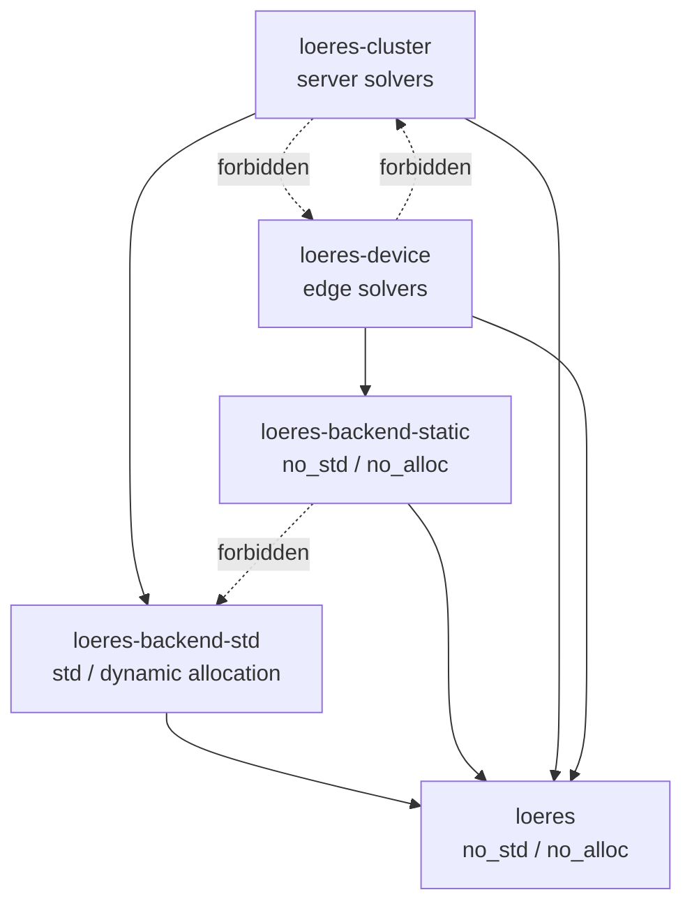

# Loeres Requirements Specification v1

**Project:** Loeres  
**Document type:** Requirements specification  
**Language:** English  
**Target implementation language:** Rust 2024 Edition  
**License policy:** Apache-2.0  
**Status:** Accepted — Milestone 1 (`loeres`) in progress (current as of v0.6.3)  
**Supersedes:** `loeres-requirements-v0.1.md`  
**Primary change theme:** Convert second-architect feedback into requirements-level constraints while avoiding premature implementation design.

> **Document currency.** This specification is current as of repository release
> **v0.6.3** and reflects the **accepted** design (no longer a draft). The
> architecture and the Milestone-1 contracts are accepted; implementation is in
> progress. No design content has changed since v0.6.1: v0.6.2 resynced the
> in-repo `docs/specs` mirrors, and v0.6.3 renamed the core crate from
> `loeres-core` to `loeres` (directory `crates/loeres/`; public module layout
> unchanged — see ADR-019).
>
> **Implemented** (`loeres`, in `rfcs/done/`):
> - **RFC 003** — allocation-free error/diagnostic topology (`SolverError`,
>   `DiagnosticSnapshot`, `error_code_to_str`); shipped v0.4.0.
> - **RFC 014** — solver outcome/status taxonomy (`SolveStatus`,
>   `TerminationReason`, `StepOutcome`, `SolveReport`, `AsCoreReport`), introducing
>   the **status/error split** — non-convergence at the iteration cap is a status,
>   not an error (recorded as ADR-018); shipped v0.5.0.
> - **RFC 001** — six-tier stratified scalar model (`BaseScalar` →
>   `OrderedScalar` → `FiniteScalar` → `DivisibleScalar` → `MetricScalar` →
>   `AdvancedNumericalScalar`); the base tier **excludes ordering** (ADR-017, with
>   §5.1.3 amended accordingly); shipped v0.6.0.
>
> **Design-finalized, not yet implemented:**
> - **RFC 002** — storage-agnostic vector/matrix access contracts. Its design was
>   finalized in v0.6.1 (architect-review patches: `dimension` naming;
>   contiguous-only core views with strided views deferred to RFC 004; an optional
>   contiguous fast path; an explicit access-error mapping over `SolverError`; no
>   overlapping mutable views). **Implementing it is the next step (v0.7.0) and
>   completes Milestone 1.**
>
> **Status:** Phase 0 (workspace skeleton — five crates plus `xtask`) is complete
> (v0.3.0); **Milestone 1 (`loeres`) is in progress** — RFC 002 implementation
> remains. 37 core tests pass with `release-gate` green (including the bare-metal
> `no_std` build). `ROADMAP.md` holds the authoritative live status.

---

## 0. Executive Summary

Loeres is a Rust workspace-based mathematical optimization library family. Its defining requirement is not merely to provide optimization algorithms, but to preserve a hard compile-time boundary between two fundamentally different execution worlds:

1. **Cluster / Server optimization**: high-throughput, dynamically allocated, parallel, cloud-native computation.
2. **Device / Edge optimization**: deterministic, allocation-free, panic-averse, real-time-safe computation for embedded, control-loop, and safety-relevant environments.

Loeres must not become a single runtime that switches between these worlds dynamically. The separation must be encoded in crate boundaries, dependency direction, feature policy, CI gates, public APIs, documentation, and release procedures. Server-side crates may depend on `std`, dynamic allocation, async runtimes, logging, metrics, BLAS/LAPACK bindings, and parallel execution libraries. Edge-facing crates must remain `#![no_std]`, must not depend on `alloc`, and must avoid transitive dependency paths that introduce `std` or heap allocation.

The project therefore adopts a library-family architecture:

- `loeres`: minimal `#![no_std]`, no-`alloc` mathematical contracts and solver contracts.
- `loeres-backend-std`: server-side dynamic storage and numerical backend adapters.
- `loeres-backend-static`: edge-side fixed-size storage and allocation-free numerical primitives.
- `loeres-cluster`: server/cloud solver engines and orchestration APIs.
- `loeres-device`: deterministic edge/real-time solver engines.

The core design principle is:

> **Share mathematical contracts, not execution assumptions.**

This v1 document incorporates the second architectural review, the accepted RFC 001/RFC 003/RFC 014 contracts, and the RFC 002 design discussion. It deliberately keeps requirements at the constraint level: implementation code, exact trait names, and exact solver kernels must still be accepted through RFCs or already-accepted RFC amendments.

---

## 0.1 v1 Change Summary

Compared with earlier drafts, this version adds or strengthens the following points:

| Area | v1 disposition |
|---|---|
| Design stage discipline | Clarifies that this document defines requirements, not final API implementation. |
| Scalar design | Replaces the idea of one broad scalar contract with stratified scalar capability requirements. |
| Vector/matrix design | Requires small base traits and optional backend-owned kernel traits; rejects mandatory runtime polymorphism in the core baseline. |
| Trait objects | Explicitly forbids `dyn Trait` in device baseline and rejects trait-object-based core kernels. |
| Device workspace | Makes typed workspace objects the primary device requirement; raw scratch slices may be secondary. |
| Static storage | Requires reference-based APIs and fixed-storage wrappers, while avoiding hard dependence on unstable const-evaluation patterns. |
| Panic policy | Treats `no_panic`-style tooling as a release gate and diagnostic, not as formal proof. |
| Floating point | Adds reference-target and floating-point profile requirements for meaningful determinism claims. |
| CI gates | Strengthens `no_std` target checks, dependency-tree checks, and `--no-default-features` checks. |
| Terminology | Uses “constant-iteration” or “timing-stabilized” instead of “constant-time” unless side-channel proof exists. |

---

## 1. Project Goals

### 1.1 Primary Goals

| ID | Goal | Requirement |
|---|---|---|
| G-001 | Compile-time isolation | Edge-facing crates must compile without `std` and without `alloc`, including transitive dependencies. |
| G-002 | Zero-cost abstraction | Common solver contracts must be expressible in `loeres` without runtime polymorphism, hidden allocation, or storage assumptions. |
| G-003 | Deterministic edge execution | `loeres-device` must provide bounded-iteration, fixed-memory solver paths suitable for WCET-oriented review. |
| G-004 | Server throughput | `loeres-cluster` must support dynamic problem sizes, parallelism, async integration, observability, and optional native numerical backends. |
| G-005 | Explicit solver scope separation | Server solvers may target large, flexible, and dynamic problems; device solvers must target small, structured, bounded problems. |
| G-006 | Rust-native safety posture | Safe Rust must be preferred; any `unsafe` or FFI boundary must be isolated, audited, feature-gated, and unavailable to edge crates. |
| G-007 | Workspace maintainability | The Cargo workspace must make dependency direction and publish boundaries obvious to maintainers and users. |
| G-008 | Design-before-implementation workflow | Requirements, ADRs, and RFCs must precede public API stabilization. Example API sketches are non-normative until accepted by RFC. |

### 1.2 Non-Goals

| ID | Non-goal | Explanation |
|---|---|---|
| NG-001 | Unified runtime selector | Loeres must not provide one runtime function that dynamically chooses server or edge mode. The choice must be made by crate selection and compilation. |
| NG-002 | Feature parity between server and edge | Edge solvers do not need to match server solver breadth. Edge support is intentionally smaller and more constrained. |
| NG-003 | Edge modeling DSL | Expression parsing, symbolic modeling, dynamic variable registries, and user-facing modeling languages are forbidden in edge-facing crates. |
| NG-004 | Full replacement for mature monolithic solvers at v0.x | Loeres is initially an architecture-first Rust library family, not an immediate replacement for Gurobi, HiGHS, Ipopt, or similar mature engines. |
| NG-005 | Hidden FFI in core | `loeres` must never hide calls into C/C++/Fortran numerical engines or platform runtimes. |
| NG-006 | Allocation convenience in edge | Edge APIs must not introduce `Vec`, `Box`, `String`, `HashMap`, dynamic collections, or heap-based convenience APIs. |
| NG-007 | Panic as control flow | Solver failure, invalid input, singular matrices, and ill-conditioned problems must be represented as explicit errors, not panics. Non-convergence is a bounded status (RFC 014), likewise never a panic. |
| NG-008 | Runtime polymorphism in edge baseline | Edge baseline APIs must not require `dyn Trait`, virtual dispatch, plugin registries, or object-safe solver abstractions. |
| NG-009 | Nightly-only core requirements | The core architecture must not depend on nightly-only Rust features unless a later RFC explicitly accepts the portability cost. |
| NG-010 | Cryptographic constant-time claim | Loeres v0.x must not claim cryptographic constant-time execution. It may define constant-iteration or timing-stabilized modes with narrower meaning. |

---

## 2. Target Users and Use Cases

### 2.1 Server / Cluster Users

Server users need high-throughput optimization over large or variable-sized models. They may run Loeres inside SaaS systems, batch jobs, distributed services, logistics engines, scheduling platforms, energy grid analysis, or analytics pipelines.

Representative requirements:

- Dynamic dimensions.
- Batch solving.
- Multi-threaded execution.
- Async service integration.
- Logging, metrics, tracing, cancellation, and time budgeting.
- Optional FFI adapters to mature numerical engines.
- Support for large sparse or dense matrices.
- Support for solver families that are not deterministic enough for edge use.
- Isolation policies for multi-tenant service operation.

### 2.2 Device / Edge Users

Device users need small, predictable optimization kernels for real-time or near-real-time environments. Example domains include robotics, model predictive control, industrial controllers, autonomous systems, medical IoT, smart-grid devices, and inference-adjacent decision policies.

Representative requirements:

- No heap allocation.
- `#![no_std]` compatibility.
- No OS dependency.
- Fixed dimensions known at compile time or initialization time.
- Bounded iteration count.
- Bounded stack and static memory footprint.
- Explicit non-convergence handling.
- Panic-averse or panic-free public solve paths.
- Stable timing behavior suitable for WCET review.
- Reference-target documentation for floating-point behavior.

### 2.3 Project Positioning

Loeres is not a single solver. It is a family of crates that share mathematical interfaces while intentionally refusing to merge server and edge execution assumptions.

A correct Loeres architecture is one where:

- A cloud service can use dynamic allocation, async orchestration, metrics, tracing, and server numerical backends without contaminating device crates.
- An embedded controller can depend on `loeres-device` and `loeres-backend-static` without pulling in `std`, `alloc`, async runtimes, logging frameworks, or server numerical engines.

---

## 3. Architectural Principles

### 3.1 Share Contracts, Not Storage

`loeres` defines mathematical contracts: scalar capabilities, vector and matrix access contracts, problem contracts, iteration contracts, convergence contracts, solver state contracts, and error types. It must not define concrete storage such as `Vec`, `ndarray::Array`, `nalgebra::DMatrix`, `heapless::Vec`, or concrete fixed-array wrappers.

Concrete storage belongs in backend crates.

### 3.2 Compile-Time Boundary Over Runtime Configuration

Server and edge behavior must be selected by dependencies and target crates, not runtime flags. A binary depending on `loeres-device` must not accidentally include `loeres-cluster`, `tokio`, `rayon`, `std`, dynamic allocation, logging frameworks, or native numerical libraries.

Feature flags may enable optional behavior inside a crate, but they must not blur the server/edge crate boundary.

### 3.3 Monomorphization Over Trait Objects

Core solver abstractions must prefer generics and associated types over `dyn Trait`. This allows the compiler to monomorphize solver code for concrete storage backends without runtime dispatch overhead.

Trait objects may be acceptable in server-only crates where dynamic orchestration is needed. They are not part of the edge baseline and must not be required by `loeres` contracts intended for device use.

### 3.4 Minimal Base Traits, Optional Capability Traits

Base traits must remain small. Expensive, specialized, or backend-specific operations must be expressed as optional extension traits or backend-owned kernel traits.

This applies especially to:

- Scalar operations such as division, square root, powers, transcendental functions, and fixed-point conversions.
- Matrix/vector kernels such as row dot products, factorization, sparse traversal, preconditioner application, and SIMD kernels.

### 3.5 Explicit Failure Over Hidden Panics

All expected **failure** modes must be represented by typed errors (`SolverError`), never hidden panics:

- Dimension mismatch.
- Non-finite input.
- Invalid input.
- Ill-conditioned problem.
- Singular or near-singular matrix.
- Workspace too small.
- Unsupported problem structure.
- Numerical domain violation.
- Internal invariant violation.

Non-convergence and reaching the iteration cap are **not** failures. Under the
RFC 014 status/error split they are bounded solver *statuses*
(`SolveStatus::NotConverged` with `TerminationReason::IterationCap`), returned in
`Ok(SolveReport)`, never as `SolverError` variants (ADR-018).

### 3.6 Typed Workspace Over Hidden Buffers

Solvers must not allocate hidden work buffers. Device solvers must use explicit caller-owned workspaces. Typed workspace objects are preferred over raw scratch slices for primary device APIs because they make memory footprint and dimension assumptions easier to review.

Raw scratch slices may exist as secondary low-level APIs only when their sizing and failure behavior are explicit.

### 3.7 Edge Simplicity Is a Feature

The edge side is intentionally restrictive. It should be small, analyzable, and boring. The server side can be rich, dynamic, and extensible.

---

## 4. Workspace and Crate Structure

### 4.1 Required Workspace Layout

```text
loeres/
├── Cargo.toml
├── LICENSE
├── NOTICE
├── README.md
├── CHANGELOG.md
├── ROADMAP.md
├── TERMS_OF_USE.md
├── docs/
│   └── src/
├── crates/
│   ├── loeres/
│   ├── loeres-backend-std/
│   ├── loeres-backend-static/
│   ├── loeres-cluster/
│   └── loeres-device/
├── examples/
│   ├── cluster-batch-solve/
│   └── device-fixed-qp/
├── xtask/
└── .github/
    ├── workflows/
    ├── SECURITY.md
    ├── CONTRIBUTING.md
    ├── CODE_OF_CONDUCT.md
    └── ISSUE_TEMPLATE/
```

### 4.2 Required Crate Responsibilities

| Crate | Layer | Environment | Responsibility | Forbidden dependencies |
|---|---:|---|---|---|
| `loeres` | 1 | `no_std`, no `alloc` | Abstract mathematical contracts, problem contracts, solver contracts, scalar capability contracts, errors | `std`, `alloc`, dynamic storage, async, logging, FFI |
| `loeres-backend-std` | 2 | `std` | Dynamic matrix/vector storage adapters, dense/sparse server math, optional numerical backend integration | None by policy, but heavy deps must be feature-gated |
| `loeres-backend-static` | 2 | `no_std`, no `alloc` | Fixed-size vectors/matrices, const-generic storage wrappers, bounded workspaces | `std`, `alloc`, async, logging, FFI |
| `loeres-cluster` | 3 | `std` | Server solver engines, batching, parallelism, async integration, observability, service-facing APIs | Must not be a dependency of edge crates |
| `loeres-device` | 3 | `no_std`, no `alloc` | Deterministic solver engines for fixed-size structured problems | `std`, `alloc`, async, logging, dynamic dispatch baseline, FFI |

### 4.3 Dependency Direction



Rules:

1. `loeres` depends on no Loeres crate.
2. `loeres-backend-static` depends on `loeres` only, plus approved `no_std`/no-`alloc` dependencies if accepted by RFC.
3. `loeres-device` depends only on `loeres`, `loeres-backend-static`, and approved `no_std`/no-`alloc` dependencies.
4. `loeres-backend-std` may depend on `loeres` and server numerical dependencies.
5. `loeres-cluster` may depend on `loeres` and `loeres-backend-std`.
6. No edge-facing crate may depend on a server-facing crate.
7. No core-facing contract may require a server-facing type.

### 4.4 Workspace Manifest Requirements

The root workspace manifest must make the separation visible. At minimum:

- All crates must live under `crates/`.
- Workspace dependency declarations must not accidentally unify server and edge dependencies.
- Default features must be conservative.
- `loeres` must have no default features that pull optional dependencies.
- `loeres-backend-static` and `loeres-device` must be testable with `--no-default-features`.
- Server-side feature groups must not be default-enabled by workspace-level convenience.

Example feature policy language:

```text
Core features:
- default = []
- optional scalar profiles only if they do not require std or alloc

Device features:
- default = [] or minimal deterministic baseline
- no feature may enable std or alloc
- diagnostic features must remain no_std/no_alloc

Cluster features:
- default may include std server baseline
- async, rayon, tracing, FFI, BLAS/LAPACK must be opt-in or clearly documented
```

This is policy guidance, not final `Cargo.toml` syntax.

---

## 5. Crate-Level Requirements

## 5.1 `loeres`

### 5.1.1 Purpose

`loeres` is the minimal abstract backbone. It defines contracts that both server and device sides can implement without importing execution assumptions.

### 5.1.2 Required Properties

| ID | Requirement |
|---|---|
| CORE-001 | Must be `#![no_std]`. |
| CORE-002 | Must not depend on `alloc`. |
| CORE-003 | Must not depend on dynamic storage crates. |
| CORE-004 | Must not depend on async runtimes, logging frameworks, metrics frameworks, OS APIs, or FFI numerical engines. |
| CORE-005 | Must define small, capability-oriented scalar contracts rather than one broad scalar trait. |
| CORE-006 | Must define vector and matrix base access contracts without assuming storage layout. |
| CORE-007 | Must define allocation-free error types suitable for no-alloc use. |
| CORE-008 | Must support solver state and iteration contracts without hidden allocation. |
| CORE-009 | Must avoid mandatory trait objects in core contracts used by device solvers. |
| CORE-010 | Must not require `fmt::Display` for core error handling. `Debug` may be supported; server crates may add richer presentation. |
| CORE-011 | Must not require square root, powers, transcendental functions, dynamic formatting, or division in the minimal scalar base. |
| CORE-012 | Must not define high-performance linear algebra kernels as mandatory base trait methods. Such kernels must be optional extension contracts or backend-owned traits. |
| CORE-013 | Must not include concrete storage wrappers such as fixed arrays, heapless buffers, ndarray arrays, or nalgebra matrices. |
| CORE-014 | Must not use `#![no_main]`; it is a library crate, not a freestanding binary entrypoint. |

### 5.1.3 Core API Requirements, Not Final API

The core API must be designed through RFCs. This requirements document imposes the following constraints but does not freeze exact trait names or method signatures.

#### Scalar capability requirements

The scalar model must be stratified:

| Capability | Requirement |
|---|---|
| Base scalar | Copyable numeric value with equality behavior, identity values, and basic additive/multiplicative operations. It does not require ordering, division, metric comparison, finite checking, or transcendental functions. |
| Ordered scalar | Extends base scalar with ordering and Loeres-defined `min`, `max`, and `clamp` semantics. Required by solvers or validation logic that perform projection, comparison, bounds checks, or ordering-dependent convergence decisions. |
| Finite check | A scalar capability must exist for rejecting NaN/Inf-like values when relevant. |
| Absolute value | A scalar capability must exist for convergence and tolerance checks. |
| Division | Division must be explicit and checked where numerical domain violations matter. It must not be implicit in the base scalar contract unless justified by RFC. |
| Square root | Square root must be an optional capability for algorithms that need it. |
| Powers/transcendentals | These must be optional and solver-specific, not part of the base scalar requirement. |
| Fixed-point | Fixed-point scalar support is a future design topic, not a current baseline. |

#### Vector and matrix base requirements

The base vector/matrix contracts must provide enough structure for problem definitions and generic algorithms, while keeping implementation freedom for backends.

At requirements level, the design must support:

- Dimension queries.
- Checked element reads.
- Checked element writes where mutability is required.
- Fill or reset operations where necessary for workspace reuse.
- Optional static-dimension contracts for fixed-size backends.
- Optional contiguous-access contracts for backends that can expose slices safely.
- Optional kernel contracts for row dot products, matrix-vector products, factorization, or sparse traversal.

The base contracts must not require:

- `Vec` or heap allocation.
- Runtime trait objects.
- Contiguous memory layout.
- Dynamic dimension storage.
- Server numerical libraries.
- Backend-specific kernel methods as mandatory operations.

#### Problem-family requirements

`loeres` must represent mathematical problem families without committing to storage or execution models.

Minimum problem families for v0.x planning:

| ID | Family | Core requirement |
|---|---|---|
| PF-001 | LP | Core may define contracts for linear objectives and linear constraints. |
| PF-002 | QP | Core may define contracts for quadratic objectives and linear constraints. |
| PF-003 | SOCP | Core may define contracts for second-order cone structures if device suitability is justified. |
| PF-004 | Generic iterative problem | Core may define minimal contracts for evaluate/step patterns. |

Important scope rule:

- Core contracts describe mathematical shape.
- Solver crates decide which problem families they implement.
- Device crates must not inherit server-only modeling breadth by default.

## 5.2 `loeres-backend-std`

### 5.2.1 Purpose

`loeres-backend-std` provides dynamic storage and high-throughput numerical backend integrations for server use.

### 5.2.2 Required Properties

| ID | Requirement |
|---|---|
| BSTD-001 | May depend on `std`. |
| BSTD-002 | May use heap allocation. |
| BSTD-003 | May wrap dynamic dense matrix libraries. |
| BSTD-004 | May wrap sparse matrix libraries. |
| BSTD-005 | May provide adapters to BLAS/LAPACK or other native libraries only behind explicit features. |
| BSTD-006 | Must not be required by `loeres`, `loeres-backend-static`, or `loeres-device`. |
| BSTD-007 | Must expose server backend capabilities without changing core contracts. |
| BSTD-008 | Must document memory and threading assumptions for each optional backend. |

### 5.2.3 Suggested Feature Areas

These are allowed design areas, not mandatory current implementation tasks:

- Dynamic dense vector/matrix adapters.
- Sparse matrix adapters.
- Batch matrix operations.
- Multi-threaded kernels.
- Optional SIMD-oriented kernels.
- Optional BLAS/LAPACK integration.
- Conversion between server storage formats.
- Diagnostic support for allocations and numerical conditioning.

## 5.3 `loeres-backend-static`

### 5.3.1 Purpose

`loeres-backend-static` provides fixed-size, allocation-free storage and primitive kernels for edge/device use.

### 5.3.2 Required Properties

| ID | Requirement |
|---|---|
| BSTATIC-001 | Must be `#![no_std]`. |
| BSTATIC-002 | Must not depend on `alloc`. |
| BSTATIC-003 | Must use fixed-size storage or caller-provided storage. |
| BSTATIC-004 | Must not allocate hidden buffers. |
| BSTATIC-005 | Must not depend on `loeres-backend-std`. |
| BSTATIC-006 | Must not expose APIs that silently truncate, silently overflow, or silently ignore failed writes. |
| BSTATIC-007 | Must prefer checked operations that return explicit errors. |
| BSTATIC-008 | Must expose memory footprint in types, constants, documentation, or metadata sufficient for review. |
| BSTATIC-009 | Must prefer borrowed arguments for large vectors/matrices and workspaces to avoid accidental stack copies. |
| BSTATIC-010 | Must use transparent fixed-storage wrappers where that improves trait implementation and API safety. |
| BSTATIC-011 | Must not require unstable compile-time arithmetic constraints as a baseline. |
| BSTATIC-012 | May reject zero-sized or invalid dimensions through constructors, type aliases, feature-specific static assertions, or RFC-approved stable techniques. |

### 5.3.3 Fixed Storage Design Requirements

The static backend must support fixed-size vector and matrix concepts, but exact type names are deferred to backend RFCs.

Requirements:

- Fixed vectors must have a statically reviewable capacity.
- Fixed matrices must have statically reviewable row and column dimensions.
- Large fixed data structures must not be passed by value in public solver APIs except where explicitly justified.
- Conversions from arrays must be explicit.
- Fallible construction must expose failure reasons.
- Indexing operations used by solver kernels must be checked or proven safe by local invariants.
- Public APIs must not expose unchecked indexing as the default path.

## 5.4 `loeres-cluster`

### 5.4.1 Purpose

`loeres-cluster` provides server-side solver engines and orchestration APIs for dynamic, high-throughput workloads.

### 5.4.2 Required Properties

| ID | Requirement |
|---|---|
| CLUSTER-001 | May depend on `std`. |
| CLUSTER-002 | May use heap allocation. |
| CLUSTER-003 | May support async interfaces. |
| CLUSTER-004 | May support multi-threaded execution. |
| CLUSTER-005 | May integrate logging, metrics, and tracing. |
| CLUSTER-006 | Must provide explicit cancellation or time-budget mechanisms for long-running solves. |
| CLUSTER-007 | Must not be required by `loeres-device`. |
| CLUSTER-008 | Must isolate optional FFI or native solver integrations behind explicit features. |
| CLUSTER-009 | Must document multi-tenant data isolation assumptions when used in services. |
| CLUSTER-010 | Must represent solver failure as typed errors, not service-level panics. |

### 5.4.3 Server Solver Families

Server-side solvers may target:

- Large LP.
- Large QP.
- Sparse optimization.
- Interior-point methods.
- First-order methods.
- Mixed-integer programming adapters.
- Nonlinear optimization adapters.
- Batch and streaming optimization workflows.

Server solver breadth must not imply device solver obligations.

## 5.5 `loeres-device`

### 5.5.1 Purpose

`loeres-device` provides deterministic, allocation-free solver engines for fixed-size structured problems.

### 5.5.2 Required Properties

| ID | Requirement |
|---|---|
| DEVICE-001 | Must be `#![no_std]`. |
| DEVICE-002 | Must not depend on `alloc`. |
| DEVICE-003 | Must not use async runtimes, OS APIs, logging frameworks, or FFI engines. |
| DEVICE-004 | Must use bounded iteration loops. |
| DEVICE-005 | Must expose max-iteration configuration or compile-time constants. |
| DEVICE-006 | Must report non-convergence as an explicit bounded status (`SolveStatus::NotConverged`, RFC 014), not as an error and not as a panic. |
| DEVICE-007 | Must avoid `unwrap`, `expect`, unchecked indexing, and panic-based validation in public solve paths. |
| DEVICE-008 | Must support caller-owned typed workspaces as the primary workspace model. |
| DEVICE-009 | Must document memory footprint, iteration bounds, and expected target assumptions. |
| DEVICE-010 | Must support release gates for panic-averse or panic-free entrypoints where feasible. |
| DEVICE-011 | Must not claim formal panic freedom unless backed by an accepted verification method. |
| DEVICE-012 | Must not require runtime trait objects in baseline solve paths. |
| DEVICE-013 | Must define reference-target and floating-point profile requirements before making deterministic timing or numerical reproducibility claims. |

### 5.5.3 Edge Solver Scope

Initial edge solver scope should be intentionally narrow:

- Small dense QP.
- Structured convex problems.
- Fixed-dimension control-loop problems.
- Bounded first-order methods.
- Conservative bounded line-search variants if each inner loop is capped.
- Optional constant-iteration modes for timing-sensitive deployments.

Edge solver scope must exclude by default:

- Mixed-integer programming.
- Dynamic modeling DSLs.
- Runtime variable registration.
- Runtime expression parsing.
- Unbounded adaptive algorithms.
- Native solver FFI.
- Thread pools.
- Async runtime usage.

---

## 6. API Design Requirements

### 6.1 Trait-Driven Inversion of Control

Loeres must use trait-driven inversion of control:

- Problem types provide objective and constraint behavior.
- Backends provide storage and primitive operations.
- Solvers drive iteration using explicit state and workspace.
- Execution crates decide whether the implementation is server-style or device-style.

Core traits must not encode server storage or device storage directly.

### 6.2 Error Requirements

`loeres` must define an allocation-free error model. Requirements:

| ID | Requirement |
|---|---|
| ERR-001 | Error values must be representable without heap allocation. |
| ERR-002 | Error values must be usable in `no_std` and no-`alloc` contexts. |
| ERR-003 | Expected solver failures must be errors, not panics. |
| ERR-004 | Errors must distinguish invalid input, non-finite input, dimension mismatch, singularity, ill-conditioning, workspace shortage, unsupported structure, numerical domain violation, and internal invariant violation. (Non-convergence is a status, not an error — RFC 014.) |
| ERR-005 | Error display suitable for humans may be added by server crates, but must not be required by core. |
| ERR-006 | Errors must be stable enough for downstream matching, but v0.x may revise variants through documented breaking changes. |

### 6.3 Scalar Requirements

The scalar design must avoid a single oversized trait. Requirements:

| ID | Requirement |
|---|---|
| SCALAR-001 | The base scalar contract must be minimal. |
| SCALAR-002 | Operations such as division, square root, powers, and transcendental functions must be optional capabilities unless required by a specific accepted solver RFC. |
| SCALAR-003 | Division used in solver logic must be checked or guarded against zero/near-zero denominators. |
| SCALAR-004 | Finite-value checks must be available for floating-point solvers. |
| SCALAR-005 | Tolerance and epsilon semantics must be explicit per solver family. |
| SCALAR-006 | Device solver documentation must state whether `f32`, `f64`, fixed-point, or other scalar profiles are supported. |
| SCALAR-007 | Cross-target numerical reproducibility must not be claimed without a documented floating-point profile and test matrix. |

### 6.4 Vector and Matrix Requirements

The vector and matrix design must support multiple backends without forcing any one storage representation.

| ID | Requirement |
|---|---|
| VM-001 | Base traits must expose dimensions and checked access. |
| VM-002 | Mutable traits must expose checked writes. |
| VM-003 | Static-dimension traits may expose compile-time dimensions. |
| VM-004 | Contiguous-access traits must be optional. |
| VM-005 | High-performance kernels must be optional extension traits or backend-owned traits. |
| VM-006 | Core vector/matrix traits must not require runtime trait objects. |
| VM-007 | Edge baseline solver APIs must not depend on dynamic dispatch. |
| VM-008 | Server crates may add object-safe wrappers if needed for dynamic orchestration. |

### 6.5 Workspace Requirements

Solvers must make workspace needs explicit.

| ID | Requirement |
|---|---|
| WS-001 | No solver may allocate hidden work buffers in edge-facing crates. |
| WS-002 | Device solvers must accept caller-owned workspace. |
| WS-003 | Typed workspace objects are the primary device workspace model. |
| WS-004 | Raw scratch-slice APIs may exist only as lower-level or advanced APIs with explicit required-size checks. |
| WS-005 | If a provided workspace is too small, the solver must fail before partial solve side effects where feasible. |
| WS-006 | Workspace memory footprint must be documented for each device solver. |
| WS-007 | Workspace reuse must have explicit reset or initialization semantics. |
| WS-008 | Server solvers may allocate dynamically but should provide diagnostics or controls for large allocations. |

### 6.6 Solver Step and Solve-Loop Requirements

| ID | Requirement |
|---|---|
| STEP-001 | Solver iteration must use explicit state. |
| STEP-002 | Solver outcomes must distinguish convergence, continuation, non-convergence, and invalid/failure states. |
| STEP-003 | Device solve loops must be bounded by fixed iteration caps. |
| STEP-004 | Adaptive inner loops in device solvers must also have explicit caps. |
| STEP-005 | Constant-iteration modes may run a fixed number of iterations even after convergence, but must document numerical and timing semantics. |
| STEP-006 | Early-exit modes may exist, but must not be described as timing-stabilized. |
| STEP-007 | Solver state mutation order must be documented where partial failure can leave state in an intermediate form. |

---

## 7. Memory, Panic, and Determinism Requirements

### 7.1 Server Memory Policy

Server crates may allocate. Requirements:

- Large allocations must be explicit enough to diagnose.
- Batch solvers should expose capacity or budget controls where feasible.
- FFI-backed memory ownership must be documented.
- Memory reuse should be available for high-throughput paths.
- Multi-tenant service use must document isolation boundaries.

### 7.2 Device Memory Policy

Device crates must not allocate from the heap. Requirements:

- No `Vec`, `Box`, `String`, `HashMap`, `BTreeMap`, or heap-backed collections.
- No hidden `alloc` dependencies.
- No dynamic formatting that requires allocation.
- Fixed-size or caller-owned buffers only.
- Public API must make workspace and memory footprint reviewable.

### 7.3 Panic Policy

| ID | Requirement |
|---|---|
| PANIC-001 | Core and device public solve paths must not use `unwrap` or `expect`. |
| PANIC-002 | Core and device public solve paths must not use panic-based validation. |
| PANIC-003 | Edge release gates must include panic-oriented checks where feasible. |
| PANIC-004 | `no_panic`-style tooling may be used as a release gate, but must not be described as complete formal proof. |
| PANIC-005 | Any remaining panic risk in edge-facing crates must be documented as a release blocker or explicit waiver. |
| PANIC-006 | Internal invariant violations must be expressible as errors where recovery or safe shutdown is possible. |

The project must distinguish between:

- **Panic-averse engineering**: code style, review rules, and test gates designed to avoid panics.
- **Tool-assisted panic checks**: build/release gates that attempt to detect panic paths.
- **Formal proof**: a stronger claim that requires a separate accepted verification method.

Loeres v0.x should target the first two unless a later verification RFC establishes the third.

### 7.4 Determinism Policy

Device determinism requirements:

| ID | Requirement |
|---|---|
| DET-001 | Device solvers must have explicit max-iteration caps. |
| DET-002 | Device solvers must document all adaptive loops and their caps. |
| DET-003 | Device solvers must document memory footprint. |
| DET-004 | Device solvers must document scalar type assumptions. |
| DET-005 | Device solvers must document floating-point target assumptions before claiming reproducible numerical behavior. |
| DET-006 | Device solvers must provide reference-target guidance for WCET-oriented review. |
| DET-007 | Constant-iteration modes must be named as such and must not be called cryptographic constant-time without proof. |
| DET-008 | Fast-math-like transformations must not be part of safety-oriented default profiles. |
| DET-009 | Timing-sensitive deployments must be able to choose early-exit or constant-iteration behavior explicitly. |

### 7.5 Floating-Point Profile Requirements

Floating-point behavior is a requirements-level concern because edge determinism cannot be evaluated without target assumptions.

Loeres must define, before stabilizing device solver claims:

- A reference edge target or target family.
- Supported scalar types for device solvers.
- Required compiler profile assumptions.
- Whether hardware floating point is required.
- Whether software floating point is supported.
- Whether fast-math-like assumptions are forbidden.
- Numerical tolerance semantics.
- Whether bit-for-bit reproducibility is a goal, non-goal, or future RFC topic.

A Cargo feature alone must not be treated as sufficient to guarantee floating-point determinism.

---

## 8. Security and Threat Model Requirements

### 8.1 Server Threats

Server-side threats include:

- Malicious optimization models designed to consume CPU or memory.
- Ill-conditioned inputs that trigger pathological numerical behavior.
- Tenant-to-tenant data leakage.
- FFI memory unsafety.
- Native solver binary compromise.
- Sensitive data leakage through logs, traces, metrics, or panic messages.

Server requirements:

| ID | Requirement |
|---|---|
| SEC-S-001 | Server solvers must support time or iteration budgets. |
| SEC-S-002 | Batch solving must expose cancellation or interruption where feasible. |
| SEC-S-003 | FFI adapters must be feature-gated and documented. |
| SEC-S-004 | Logs and metrics must not expose sensitive model data by default. |
| SEC-S-005 | Multi-tenant use must document isolation boundaries and non-guarantees. |
| SEC-S-006 | Server panic messages must not be relied on for normal failure handling. |

### 8.2 Device Threats

Device-side threats include:

- Input designed to trigger infinite loops.
- Input designed to trigger division by zero or numerical domain violations.
- Non-finite data injection.
- Resource exhaustion through repeated solve requests.
- Control-loop destabilization through unpredictable execution time.
- Buffer misuse or indexing errors.

Device requirements:

| ID | Requirement |
|---|---|
| SEC-D-001 | Device solvers must validate dimensions and scalar inputs before entering critical loops where feasible. |
| SEC-D-002 | Device solvers must reject non-finite floating-point inputs where applicable. |
| SEC-D-003 | Device solvers must enforce iteration caps. |
| SEC-D-004 | Device solvers must not allocate heap memory in response to input. |
| SEC-D-005 | Device solvers must return explicit errors on invalid or adversarial inputs. |
| SEC-D-006 | Device solvers must document behavior on ill-conditioned problems. |
| SEC-D-007 | Device solvers must avoid secret-dependent or input-dependent timing claims unless a later security RFC defines and verifies them. |

### 8.3 FFI Policy

| ID | Requirement |
|---|---|
| FFI-001 | `loeres` must not use FFI. |
| FFI-002 | `loeres-backend-static` must not use FFI. |
| FFI-003 | `loeres-device` must not use FFI. |
| FFI-004 | `loeres-backend-std` may use FFI only behind explicit features. |
| FFI-005 | `loeres-cluster` may use FFI-backed solvers only behind explicit features. |
| FFI-006 | Every FFI feature must document memory ownership, thread-safety assumptions, licensing implications, and failure behavior. |
| FFI-007 | FFI-backed solvers must not be re-exported as if they were edge-compatible. |

---

## 9. CI, Verification, and Release Gates

### 9.1 Required CI Matrix

At minimum, CI must include:

| ID | Requirement |
|---|---|
| CI-001 | `cargo check` for the full workspace on a standard host target. |
| CI-002 | `cargo test` for server-compatible crates. |
| CI-003 | `cargo check --no-default-features` for `loeres`. |
| CI-004 | `cargo check --no-default-features` for `loeres-backend-static`. |
| CI-005 | `cargo check --no-default-features` for `loeres-device`. |
| CI-006 | A real `no_std` target check for `loeres`, `loeres-backend-static`, and `loeres-device`. |
| CI-007 | Dependency-tree checks that fail if edge-facing crates activate forbidden dependencies. |
| CI-008 | Feature matrix checks for default and no-default feature combinations. |
| CI-009 | Formatting and lint checks. |
| CI-010 | Documentation build for server docs and architecture docs. |

### 9.2 Edge Dependency Checks

Edge dependency gates must check at least:

- No `std` activation in `loeres`.
- No `alloc` activation in `loeres`.
- No `std` activation in `loeres-backend-static`.
- No `alloc` activation in `loeres-backend-static`.
- No `std` activation in `loeres-device`.
- No `alloc` activation in `loeres-device`.
- No async runtime dependency in edge-facing crates.
- No logging framework dependency in edge-facing crates unless a no-alloc diagnostic RFC approves it.
- No `loeres-cluster` dependency path from edge-facing crates.
- No `loeres-backend-std` dependency path from edge-facing crates.

### 9.3 Panic and Determinism Gates

Edge release gates must include:

- Static or tool-assisted panic-path checks where feasible.
- Lint rules or review rules forbidding `unwrap`, `expect`, and panic-based validation.
- Tests for invalid dimensions.
- Tests for non-finite floating-point input where floating point is supported.
- Tests for non-convergence and max-iteration behavior.
- Tests for workspace-too-small behavior where raw scratch APIs exist.
- Build checks for the reference no-std target.
- Documentation of memory footprint and iteration bounds.

### 9.4 Release Gates

Before publishing any crate version:

| ID | Requirement |
|---|---|
| REL-001 | Dependency direction must be checked. |
| REL-002 | Edge-facing crates must pass no-std/no-alloc gates. |
| REL-003 | Public API documentation must state environment assumptions. |
| REL-004 | Feature flags must be documented. |
| REL-005 | Any `unsafe` must be documented and reviewed. |
| REL-006 | Any FFI feature must be documented and disabled by default unless explicitly accepted. |
| REL-007 | Release notes must identify breaking changes to requirements, features, solver behavior, or error variants. |
| REL-008 | v1.0 publication must require explicit project-owner confirmation. |

---

## 10. Documentation Requirements

### 10.1 Repository Documentation

The repository must include:

- `README.md` explaining the library-family architecture.
- `ROADMAP.md` explaining phased scope.
- `CHANGELOG.md`.
- `SECURITY.md`.
- `CONTRIBUTING.md`.
- `TERMS_OF_USE.md` or equivalent disclaimers for safety-critical usage.
- Crate-level READMEs for each crate.

### 10.2 Required Architecture Documentation

Architecture docs must include:

- Workspace dependency diagram.
- Crate responsibility matrix.
- Feature flag policy.
- Edge dependency isolation policy.
- Panic policy.
- Workspace/memory policy.
- Floating-point determinism policy.
- FFI policy.
- Threat model.
- ADR index.

### 10.3 API Documentation Requirements

Each public API must state:

- Whether it is server-only, device-compatible, or core-generic.
- Whether it allocates.
- Whether it may panic.
- Whether it requires `std`.
- Whether it depends on scalar capabilities beyond the base scalar contract.
- Whether it has bounded iteration behavior.
- Whether it mutates caller-provided state or workspace on failure.

### 10.4 Design/RFC Documentation Requirements

Because design must precede implementation, the project must maintain RFCs for major public API areas:

- Core trait minimalism.
- Scalar capability model.
- Static backend storage model.
- Device workspace model.
- Device determinism and panic gates.
- Server backend integration model.
- FFI and native solver adapters.
- Floating-point profile and reference target.
- First supported device solver family.

---

## 11. Feature Flag Policy

### 11.1 Core Features

`loeres` requirements:

- `default = []` unless a later RFC justifies otherwise.
- No feature may enable `std`.
- No feature may enable `alloc` without a major architecture revision.
- No feature may introduce dynamic storage dependencies.
- Scalar capability features must remain no-std/no-alloc.

### 11.2 Server Features

Server features may include:

- `std` baseline.
- Dynamic dense storage.
- Sparse storage.
- Parallel execution.
- Async interfaces.
- Tracing/metrics.
- Native numerical backend integration.
- FFI-backed mature solver adapters.

Requirements:

- Heavy features must be documented.
- FFI features must be opt-in.
- Licensing implications must be documented.
- Server features must not affect edge crates.

### 11.3 Device Features

Device features may include:

- Selected scalar profiles.
- Selected solver families.
- Diagnostic modes that remain no-std/no-alloc.
- Constant-iteration modes.
- Reference floating-point profile modes.

Requirements:

- Device features must not enable `std`.
- Device features must not enable `alloc`.
- Device features must not enable dynamic dispatch as a baseline requirement.
- Device features must not enable logging frameworks or async runtimes.
- Device features must document their memory and timing effects.

---

## 12. Initial Milestone Scope

> **Status (v0.6.3).** The original phase plan below is the scope of record. Live
> status: **Phase 0 (workspace skeleton) is complete (v0.3.0)**, all core RFCs
> (001–014) are written, and core implementation is tracked by the roadmap's
> milestone model — **Milestone 1 (`loeres`) is in progress**, with RFC 001,
> 003, and 014 implemented and RFC 002 implementation remaining (next, v0.7.0).
> See the document-currency block above and `ROADMAP.md` for authoritative status.

### 12.1 Phase 0 — Repository and Policy Foundation — ✅ complete (v0.3.0)

Deliverables:

- Workspace skeleton.
- Crate layout.
- License and contribution files.
- Architecture README.
- CI skeleton.
- Dependency direction checks.
- no-std target check scaffold.
- Initial ADRs.

Acceptance:

- Workspace compiles with placeholder crates.
- Edge-facing crates have no forbidden dependency paths.
- Documentation explains the server/device split.

### 12.2 Phase 1 — Core Requirements and RFCs

Deliverables:

- RFC for core trait minimalism.
- RFC for scalar capability model.
- RFC for vector/matrix base contracts.
- RFC for error model.
- RFC for solver state/workspace contracts.

Acceptance:

- No final API is stabilized before RFC review.
- Core remains no-std/no-alloc.
- Proposed contracts do not require concrete storage.
- Proposed contracts do not require runtime trait objects for device baseline.

### 12.3 Phase 2 — Static Backend and Device Design

Deliverables:

- RFC for static storage wrappers.
- RFC for typed workspace model.
- RFC for first device solver family.
- RFC for device panic and determinism gates.
- RFC for reference floating-point profile.

Acceptance:

- Static backend design is allocation-free.
- Public APIs use borrowed large structures.
- Workspace memory is reviewable.
- Determinism claims are tied to documented target assumptions.

### 12.4 Phase 3 — Std Backend and Cluster Design

Deliverables:

- RFC for dynamic storage adapters.
- RFC for batch solving.
- RFC for async/cancellation model.
- RFC for observability.
- RFC for optional native numerical backend integration.

Acceptance:

- Server features do not leak into edge crates.
- Server memory behavior is documented.
- FFI is feature-gated and documented.

### 12.5 Phase 4 — Implementation Baseline

Baseline implementation proceeds only for items backed by accepted requirements and RFCs. This phase is now being entered incrementally as Milestone RFCs land; RFC 001, RFC 003, and RFC 014 are already implemented in `loeres`, and RFC 002 is the remaining Milestone-1 implementation item.

Possible baseline implementation scope:

- Minimal core traits and errors.
- Minimal static vector/matrix backend.
- Minimal std vector/matrix backend.
- One small device-compatible QP or first-order solver.
- One cluster/server demo solver path.
- CI gates for no-std/no-alloc separation.

Acceptance:

- Each implementation item traces to accepted requirements and RFCs.
- No implementation shortcut weakens crate separation.

### 12.6 Phase 5 — Documentation, Benchmarking, and Hardening

Deliverables:

- mdBook or equivalent architecture docs.
- Example projects.
- Device memory footprint examples.
- Server throughput examples.
- Panic-gate reports.
- Floating-point profile documentation.
- Threat model review.

Acceptance:

- Users can determine which crate to depend on.
- Users can understand what is and is not safe for edge deployment.
- Release gates are documented and repeatable.

---

## 13. Acceptance Criteria

The requirements document is satisfied when:

| ID | Criterion |
|---|---|
| AC-001 | The workspace has separate core, backend-std, backend-static, cluster, and device crates. |
| AC-002 | `loeres` is no-std and no-alloc. |
| AC-003 | `loeres-backend-static` is no-std and no-alloc. |
| AC-004 | `loeres-device` is no-std and no-alloc. |
| AC-005 | Edge-facing crates have no dependency path to server-facing crates. |
| AC-006 | Core contracts do not require `Vec`, `Box`, `String`, dynamic collections, async, logging, or FFI. |
| AC-007 | Core contracts do not require runtime trait objects for device baseline. |
| AC-008 | Scalar capabilities are stratified rather than bundled into one broad trait. |
| AC-009 | Vector/matrix base contracts are minimal and storage-agnostic. |
| AC-010 | Device solver design uses explicit caller-owned typed workspace. |
| AC-011 | Device solver design has explicit iteration bounds. |
| AC-012 | Device solver design treats no-panic tooling as a release gate, not as proof. |
| AC-013 | Floating-point determinism claims are tied to target/profile documentation. |
| AC-014 | Server solver design supports dynamic allocation and high-throughput integration without contaminating edge crates. |
| AC-015 | FFI is unavailable to core/static/device crates. |
| AC-016 | CI includes no-std/no-alloc checks for edge-facing crates. |
| AC-017 | v1.0 publication is blocked until explicit project-owner confirmation. |

---

## 14. Open Design Questions

These questions must be resolved by RFC, not by ad-hoc implementation:

| ID | Question |
|---|---|
| OQ-001 | What is the first supported device solver family: QP, bounded first-order method, SOCP subset, or another structured problem? |
| OQ-002 | What is the reference edge target for early determinism claims? |
| OQ-003 | Is hardware floating point required for the first device solver? |
| OQ-004 | Is fixed-point support a near-term requirement or a future roadmap topic? |
| OQ-005 | Which scalar capabilities belong in the first accepted scalar RFC? **(Resolved — RFC 001, v0.6.0.)** The six-tier model, ordering split out of the base tier (ADR-017). |
| OQ-006 | Which vector/matrix kernels are common enough to define as optional core extension traits? **(Resolved in design — RFC 002, v0.6.1.)** Optional contiguous fast-path traits (`ContiguousVectorAccess` / `ContiguousVectorAccessMut` / `ContiguousMatrixAccess`); heavy kernels stay backend/solver-owned. Implementation lands with RFC 002 (v0.7.0). |
| OQ-007 | Should raw scratch-slice APIs exist in v0.x, or should the first device API be typed-workspace-only? |
| OQ-008 | Which server backend should be the first dynamic storage adapter? |
| OQ-009 | Should optional FFI solvers be included in v0.x or deferred until the Rust-native architecture is stable? |
| OQ-010 | What evidence is required before any device entrypoint is documented as panic-free? |
| OQ-011 | What level of numerical reproducibility is actually required across edge targets? |
| OQ-012 | How should Loeres document safety-critical usage limitations and disclaimers? |

---

## 15. Architectural Decisions Recorded in This Draft

| ADR | Decision | Status |
|---|---|---|
| ADR-001 | Loeres is a library family, not one unified solver crate. | Accepted |
| ADR-002 | Server and device execution models are separated by crates. | Accepted |
| ADR-003 | Compile-time isolation is preferred over runtime mode selection. | Accepted |
| ADR-004 | `loeres` is no-std and no-alloc. | Accepted |
| ADR-005 | Edge-facing crates must not depend on server-facing crates. | Accepted |
| ADR-006 | Device solvers prioritize bounded execution over feature breadth. | Accepted |
| ADR-007 | Server solvers may prioritize throughput and integration breadth. | Accepted |
| ADR-008 | FFI is forbidden in core/static/device crates. | Accepted |
| ADR-009 | Device modeling DSLs are out of scope. | Accepted |
| ADR-010 | Panic-based failure handling is out of scope for solver errors. | Accepted |
| ADR-011 | Broad scalar traits are rejected; scalar capabilities must be stratified. | Accepted |
| ADR-012 | Runtime trait-object kernels are rejected for core/device baseline. | Accepted |
| ADR-013 | Typed workspace is the primary device workspace model. | Accepted |
| ADR-014 | `no_panic`-style tooling is a release gate, not proof. | Accepted |
| ADR-015 | Floating-point determinism requires reference-target/profile documentation. | Accepted |
| ADR-016 | Requirements and RFCs precede API stabilization. | Accepted |
| ADR-017 | The base scalar tier excludes ordering; ordering is the separate `OrderedScalar` capability, and metric comparison is `MetricScalar: OrderedScalar`. This keeps storage/access traits free of comparison semantics and lets solver families state their numerical needs explicitly. Requirements §5.1.3 amended accordingly. | Accepted |
| ADR-018 | Non-convergence is a status, not an error. A bounded solve that does not converge — including reaching the iteration cap — returns `Ok(SolveReport)` with `SolveStatus::NotConverged`; only boundary rejection and fail-safe conditions are `SolverError`. The same condition is never both (RFC 014). | Accepted |
| ADR-019 | The core contracts crate is named `loeres` (not `loeres-core`). It reserves the project namespace on crates.io and follows the convention of naming the foundation crate after the library itself (e.g. `serde`, `tokio`). The crate directory is `crates/loeres/`; the public module layout is unchanged (`loeres::scalar`, `loeres::access`, `loeres::error`, `loeres::diagnostic`, `loeres::solver`). Structural rename only — no contract, trait, or API change (v0.6.3). | Accepted |

---

## Appendix A. Requirement Traceability

| Source concern | Requirement coverage |
|---|---|
| Strict server/edge separation | G-001, G-002, ADR-002, ADR-003, CI-006, CI-007 |
| Minimal shared core | CORE-001 through CORE-014 |
| No dependency bleed | BSTATIC-001 through BSTATIC-012, DEVICE-001 through DEVICE-013, CI-007 |
| Server high throughput | CLUSTER-001 through CLUSTER-010, Section 11.2 |
| Device deterministic execution | DEVICE-004 through DEVICE-013, DET-001 through DET-009 |
| Panic-free ambition | PANIC-001 through PANIC-006 |
| no-panic caution | PANIC-004, ADR-014 |
| Scalar trait risk | SCALAR-001 through SCALAR-007, ADR-011 |
| Fixed-storage copy risk | BSTATIC-009, BSTATIC-010, Section 5.3.3 |
| Typed workspace need | WS-001 through WS-008, ADR-013 |
| Floating-point determinism | DET-004 through DET-009, Section 7.5, ADR-015 |
| Avoid premature implementation | G-008, Section 10.4, Phase 1 through Phase 4 |
| Reject `dyn VectorOps` style core kernels | CORE-009, CORE-012, VM-006, ADR-012 |
| No unstable-feature dependence | NG-009, BSTATIC-011 |
| Constant-time terminology caution | NG-010, DET-007 |

---

## Appendix B. Terminology

| Term | Meaning in Loeres |
|---|---|
| Core | Minimal mathematical and solver contracts, not execution engine. |
| Backend | Storage and primitive numerical operations. |
| Cluster | Server/cloud execution engine and orchestration layer. |
| Device | Edge/real-time execution engine layer. |
| no-alloc | No dependency on Rust `alloc` and no heap-backed APIs. |
| Zero-cost abstraction | Abstraction that can compile down without runtime dispatch or allocation overhead in baseline device paths. |
| Typed workspace | Caller-owned workspace whose size and structure are represented by type-level or explicit static structure, not hidden allocation. |
| Constant-iteration | A mode that runs a fixed number of iterations regardless of early convergence. It is not equivalent to cryptographic constant-time. |
| Reference target | A documented target/compiler/profile baseline used to evaluate device timing and numerical behavior. |
| Panic-averse | Engineered to avoid panic paths through API design, review, checks, and tests, without necessarily claiming formal proof. |

---

## Appendix C. Design Policy for Future RFCs

Every RFC that modifies public architecture must answer:

1. Does this affect `loeres`?
2. Does this introduce `std`, `alloc`, FFI, logging, async, or dynamic dispatch?
3. Does this affect edge-facing crates?
4. Does this affect workspace memory requirements?
5. Does this affect iteration bounds or timing behavior?
6. Does this affect scalar capability assumptions?
7. Does this affect floating-point determinism claims?
8. Does this require unsafe code?
9. Does this require unstable Rust features?
10. Does this change the server/device separation boundary?

If the answer to any of these is yes, the RFC must include an explicit compatibility and safety section.
